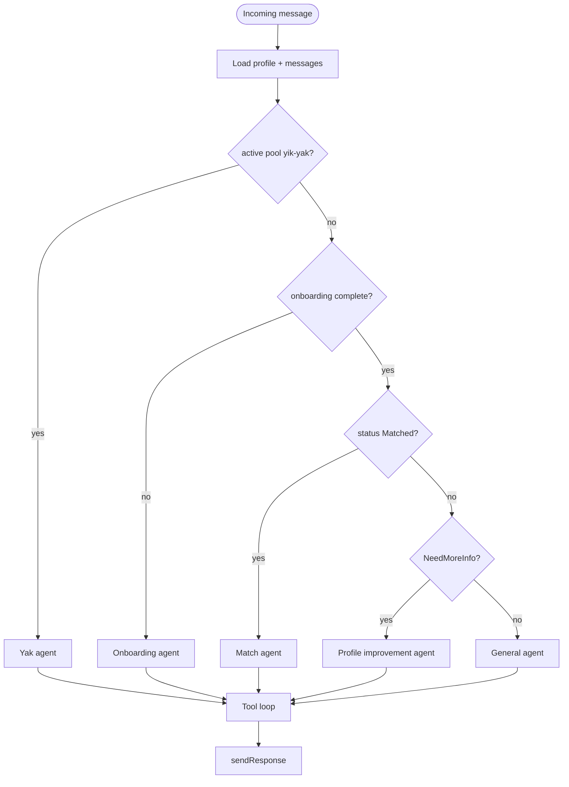

# Chatbot agent routing

One-shot routing at the start of a LangGraph turn (production). Does not re-route after tool calls within the same turn.

Target **skills-based** routing is described in [../docs/chatbot/skills-migration.md](../docs/chatbot/skills-migration.md).
