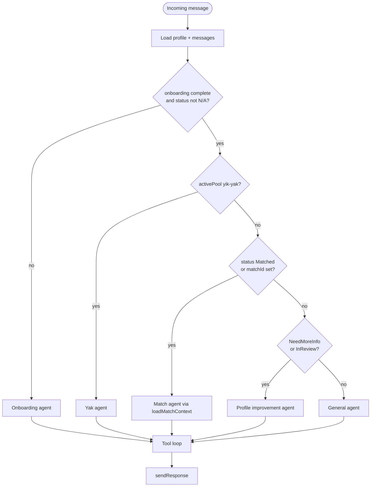

# Chatbot agent routing

One-shot routing at the start of a LangGraph turn (production). Order matches `routeToAgent` in `proj-coach-backend`—**onboarding is checked before event pools**.

## Notes

- **InReview** users go to profile improvement (same node as `NeedMoreInfo`) until analysis promotes them to `Waiting`.  
- Event pools (`nyc-gala`, `la-love-yacht`, etc.) use the **general** agent after onboarding unless `activePool === yik-yak`.  
- Routing does **not** re-run after tool calls in the same turn.  

Target **skills-based** routing: [../docs/chatbot/skills-migration.md](../docs/chatbot/skills-migration.md).  
User vs match status: [match-state-machine.md](match-state-machine.md).
