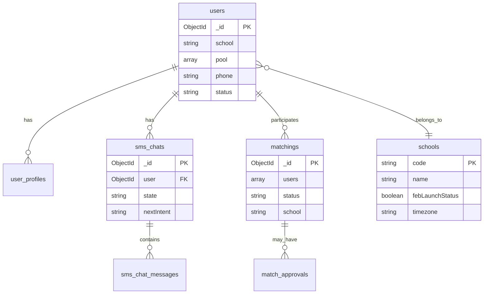

# Core data model

Logical MongoDB collections and relationships (from `@dodo-world/proj-coach-schemas`). Not every collection is shown—focus on matchmaking and SMS paths.

## Match status (simplified)

Typical progression: matching proposed → scheduling → contact exchanged → dated. Failure states include refused, expired, pick-time failed. See [match-state-machine.md](match-state-machine.md).

## Schools

- **Official** schools have `name` + `code` (e.g. `CAL`, `UCLA`).  
- **Unofficial** entries created on first `.edu` signup until ops merges or launches.  
- `users.school` references `schools.code`.

## Shared package

All services import schemas from **proj-coach-schemas** to avoid drift. When adding a field, publish the package and bump consumers.
