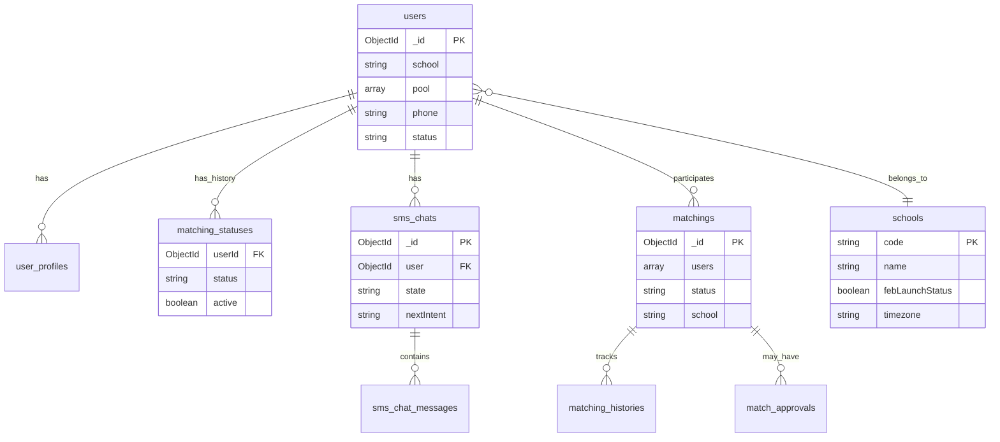

# Core data model

Logical MongoDB collections and relationships (from `@dodo-world/proj-coach-schemas`). Not every collection is shown—focus on matchmaking and SMS paths.

## Status fields (do not merge)

- **`matching_statuses.status`** — per-user eligibility (`Waiting`, `Matched`, `NeedMoreInfo`, …). Drives chatbot routing.  
- **`matchings.status`** — per-pair workflow (`Making Poster`, `TimeScheduled 1/2`, `Dated`, `PickTimeFailed`, …).  

Full enums and diagrams: [match-state-machine.md](match-state-machine.md).

## Schools

- **Official** schools have `name` + `code` (e.g. `CAL`, `UCLA`).  
- **Unofficial** entries created on first `.edu` signup until ops merges or launches.  
- `users.school` references `schools.code`.

## Shared package

All services import schemas from **proj-coach-schemas** to avoid drift. When adding a field, publish the package and bump consumers.
