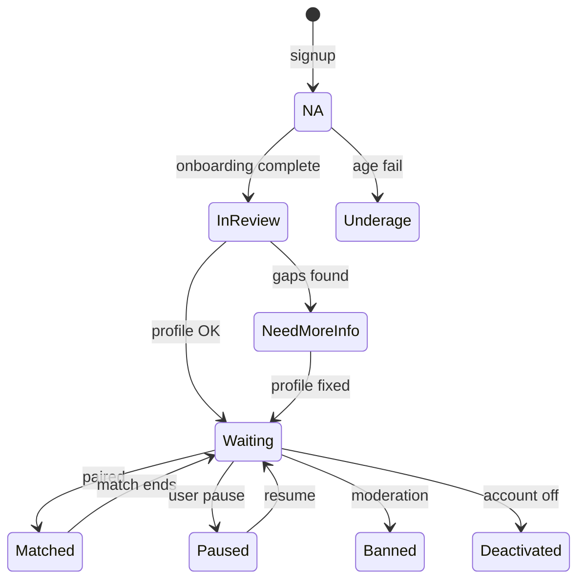
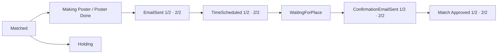

# Match and user status

Ditto uses **two different status concepts**. Confusing them breaks chatbot routing and ops reporting.

| Concept | Collection | Used for |
|---------|------------|----------|
| **User matching status** | `matching_statuses` (active row per user) | Chatbot agent routing, eligibility to be matched |
| **Match workflow status** | `matchings.status` | Lifecycle of one pair from creation to date or failure |

Source of truth for enums: `@dodo-world/proj-coach-schemas`.

---

## User matching status (`matching_statuses`)

Current status = document with `{ userId, active: true }`. History kept in prior rows with `active: false`.

| Status | Meaning |
|--------|---------|
| `N/A` | Not finished onboarding |
| `InReview` | Onboarding done; profile analysis pending |
| `NeedMoreInfo` | Profile improvement agent should run |
| `Waiting` | Eligible for next match |
| `Matched` | In an active match (chatbot → match agent) |
| `Paused` | Temporarily out of pool |
| `Banned` / `Deactivated` / `Underage` | Not operable |

Chatbot routing uses **user** status (and `activePool`, `matchId`)—see [chatbot-routing.md](chatbot-routing.md).

---

## Match workflow status (`matchings`)

Terminal and in-progress values from `MatchStatusValues` + `CompletedMatchStatusValues`.

### In progress (non-terminal)

### Terminal outcomes

| Status | Category |
|--------|----------|
| `ContactExchanged` | Success — contact shared |
| `Dated` | Success — date completed |
| `DateCancelled` | Failed — cancelled after scheduling |
| `PickTimeFailed` | Failed — scheduling failed |
| `Failed` | Failed — generic |
| `Failed - Refused` | Failed — user refused |
| `Failed - Expired` | Failed — timed out |

ENG-1030 priority tiers reference several **terminal** match outcomes (`PickTimeFailed`, `Failed - Expired`, `DateCancelled`)—see [../architecture/operations/matching-priority.md](../architecture/operations/matching-priority.md).

## Related

- [data-model.md](data-model.md) — ER view  
- [platform-topology.md](platform-topology.md) — services  
