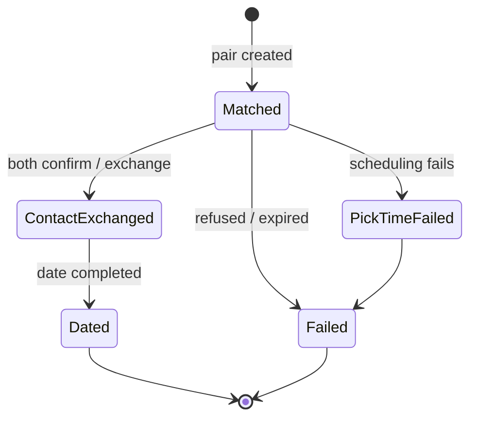

# Match lifecycle

Simplified state machine for a `matchings` document. Exact enum names live in `proj-coach-schemas`; ops tooling may show additional substates.

## Operations meaning

| State | Typical meaning |
|-------|-----------------|
| **Matched** | Pair approved; scheduling in progress |
| **PickTimeFailed** | Could not align calendars |
| **ContactExchanged** | Contact info shared |
| **Dated** | Successful date logged |
| **Failed** | Refused or expired |

Internal automation priority tiers (who gets rematched first) are defined in [../architecture/operations/matching-priority.md](../architecture/operations/matching-priority.md).
