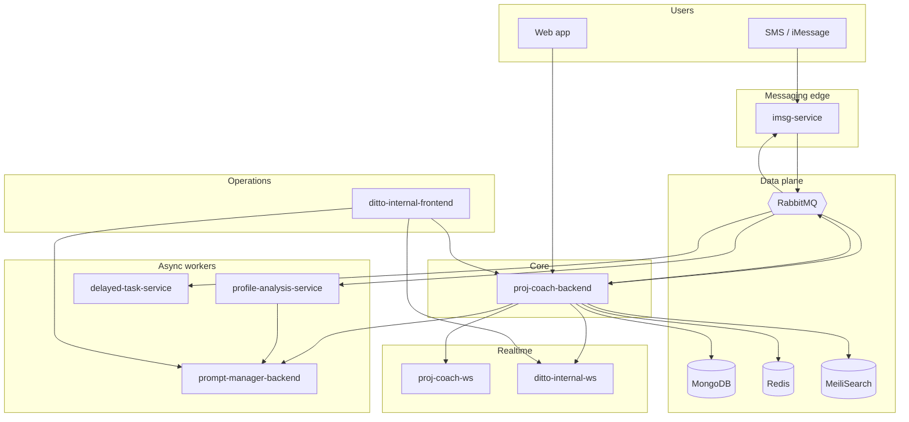

# Platform topology

High-level Ditto runtime topology. User-facing web apps exist but are omitted here where source repos are outside this bundle.

## Communication patterns

| Pattern | Used for |
|---------|----------|
| HTTPS REST | Web clients, internal dashboard → backends |
| RabbitMQ RPC | Backend → imsg, profile-analysis, delayed-task |
| RabbitMQ fanout | Backend → WebSocket services |
| gRPC | Backend / WS → auth service |
| Restate | Durable workflows in profile-analysis-service |

See also [data-model.md](data-model.md) and [sms-pipeline.md](sms-pipeline.md).
