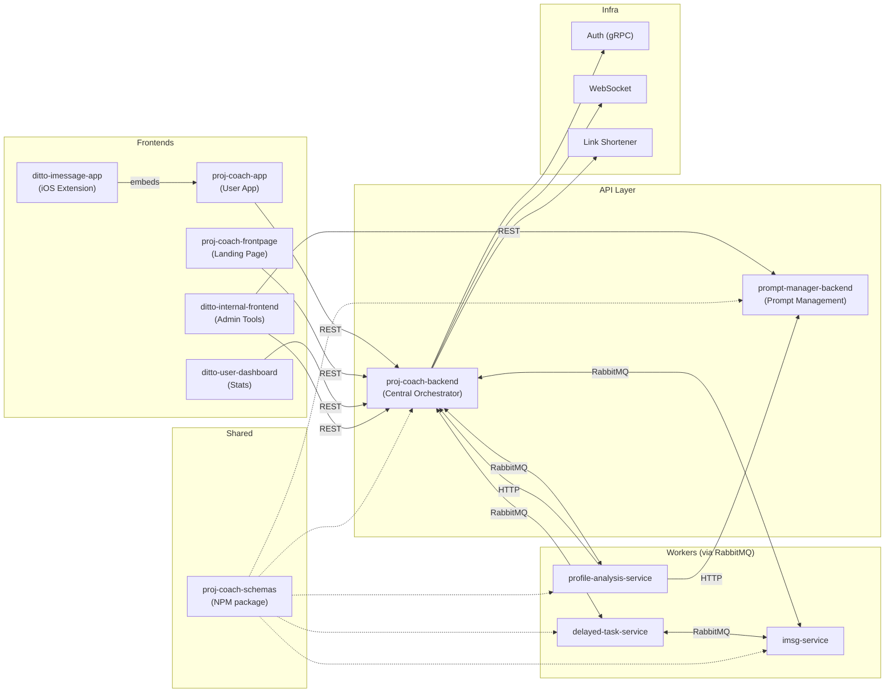

# Ditto Platform Architecture

## Service Relationship Diagram

```mermaid
graph TB
  subgraph "User-Facing Clients"
    APP["proj-coach-app<br/><i>React + Vite</i><br/>Main dating/matching app"]
    FRONTPAGE["proj-coach-frontpage<br/><i>Next.js 15</i><br/>Landing page & signup"]
    DASHBOARD["ditto-user-dashboard<br/><i>Next.js 15</i><br/>Signup stats dashboard"]
    IMSGAPP["ditto-imessage-app<br/><i>iOS Swift</i><br/>iMessage extension<br/>(embeds proj-coach-app)"]
  end

  subgraph "Internal Tools"
    INTERNAL["ditto-internal-frontend<br/><i>React + Vite</i><br/>Admin panel, matchmaking,<br/>prompt editor, messaging"]
  end

  subgraph "Core Backend Services"
    BE["proj-coach-backend<br/><i>NestJS + Bun</i><br/>Central API orchestrator"]
    PROMPT["prompt-manager-backend<br/><i>NestJS + Bun</i><br/>AI prompt versioning,<br/>chat, RPC endpoints"]
    PA["profile-analysis-service<br/><i>Bun microservice</i><br/>LLM profile analysis,<br/>matching, CLIP embeddings"]
    DT["delayed-task-service<br/><i>Bun microservice</i><br/>Scheduled emails, SMS,<br/>queue messages"]
    IMSG["imsg-service<br/><i>Bun microservice</i><br/>iMessage/SMS via<br/>SendBlue, Linq, PhotonHQ"]
  end

  subgraph "Infrastructure Services"
    AUTH["Auth Service<br/><i>gRPC</i><br/>Session management"]
    WS["WebSocket Service<br/><i>Socket.io</i><br/>Real-time (public)"]
    WSINT["WebSocket Internal<br/><i>Socket.io</i><br/>Real-time (internal)"]
    LS["Link Shortener<br/>URL shortening"]
  end

  subgraph "Shared Package"
    SCHEMAS["proj-coach-schemas<br/><i>NPM: @dodo-world/proj-coach-schemas</i><br/>Mongoose schemas & TS types"]
  end

  subgraph "Data Stores"
    MONGO[("MongoDB<br/>Primary database")]
    REDIS[("Redis<br/>Cache, locks,<br/>sessions")]
    MEILI[("MeiliSearch<br/>Full-text search")]
  end

  subgraph "Message Queue"
    RMQ{{"RabbitMQ"}}
  end

  subgraph "Third-Party: AI/ML"
    OPENAI["OpenAI"]
    OPENROUTER["OpenRouter"]
    CLAUDE_API["Claude (Anthropic)"]
    REPLICATE["Replicate<br/>(CLIP embeddings)"]
  end

  subgraph "Third-Party: Communication"
    TWILIO["Twilio (SMS)"]
    SENDGRID["SendGrid (Email)"]
    POSTMARK["Postmark (Email)"]
    TELEGRAM["Telegram Bot"]
    SENDBLUE["SendBlue (iMessage)"]
  end

  subgraph "Third-Party: Platform"
    STRIPE["Stripe (Payments)"]
    GCS["Google Cloud Storage"]
    LIVEKIT["LiveKit (Video/Audio)"]
    GOOGLE_OAUTH["Google OAuth"]
    TURNSTILE["Cloudflare Turnstile"]
  end

  subgraph "Observability"
    POSTHOG["PostHog (Analytics)"]
    LOKI["Grafana Loki (Logs)"]
    TEMPO["Tempo (Traces)"]
    FARO["Grafana Faro"]
    AMPLITUDE["Amplitude"]
    CLARITY["Microsoft Clarity"]
  end

  %% --- Frontend → Backend connections ---
  APP -->|"HTTPS REST + WebSocket"| BE
  FRONTPAGE -->|"HTTPS REST"| BE
  DASHBOARD -->|"HTTPS REST"| BE
  IMSGAPP -->|"loads web app"| APP
  INTERNAL -->|"HTTPS REST"| BE
  INTERNAL -->|"HTTPS REST"| PROMPT
  APP --> WS
  INTERNAL --> WSINT

  %% --- Backend ↔ Infrastructure ---
  BE -->|"gRPC"| AUTH
  BE -->|"HTTP"| LS
  BE -->|"fanout exchange: sockets"| WS
  BE -->|"fanout exchange: socket-internal"| WSINT

  %% --- Backend ↔ Microservices (via RabbitMQ) ---
  BE -->|"RMQ queue: profile-analysis"| RMQ
  RMQ -->|"profile-analysis"| PA
  BE -->|"RMQ queue: delayed-tasks"| RMQ
  RMQ -->|"delayed-tasks"| DT
  BE -->|"RMQ exchange: rpc → imsgs"| RMQ
  RMQ -->|"imsgs"| IMSG
  DT -->|"RMQ exchange: rpc → imsgs"| RMQ

  %% --- Microservice ↔ Backend (HTTP) ---
  PA -->|"HTTP"| PROMPT
  PA -->|"HTTP"| BE
  DT -->|"HTTP (email logging)"| BE

  %% --- Shared schemas ---
  SCHEMAS -.->|"NPM import"| BE
  SCHEMAS -.->|"NPM import"| PROMPT
  SCHEMAS -.->|"NPM import"| PA
  SCHEMAS -.->|"NPM import"| DT
  SCHEMAS -.->|"NPM import"| IMSG

  %% --- Data stores ---
  BE --- MONGO
  BE --- REDIS
  BE --- MEILI
  PROMPT --- MONGO
  PROMPT --- REDIS
  PA --- MONGO
  PA --- REDIS
  PA --- MEILI
  DT --- MONGO
  DT --- REDIS
  IMSG --- MONGO
  IMSG --- REDIS

  %% --- Third-party AI ---
  BE --> OPENAI
  BE --> OPENROUTER
  PROMPT --> OPENAI
  PROMPT --> OPENROUTER
  PROMPT --> CLAUDE_API
  PA --> OPENROUTER
  PA --> REPLICATE

  %% --- Third-party Comms ---
  BE --> TWILIO
  BE --> SENDGRID
  BE --> POSTMARK
  BE --> TELEGRAM
  DT --> SENDGRID
  DT --> POSTMARK
  IMSG --> SENDBLUE

  %% --- Third-party Platform ---
  BE --> STRIPE
  BE --> GCS
  BE --> LIVEKIT
  BE --> GOOGLE_OAUTH
  BE --> TURNSTILE

  %% --- Observability ---
  BE --> POSTHOG
  BE --> LOKI
  BE --> TEMPO
  PA --> POSTHOG
  DT --> POSTHOG
  IMSG --> POSTHOG
  APP --> POSTHOG
  APP --> AMPLITUDE
  APP --> CLARITY
  APP --> FARO
  FRONTPAGE --> POSTHOG
  FRONTPAGE --> AMPLITUDE
  INTERNAL --> POSTHOG

  %% --- Styling ---
  classDef frontend fill:#4f8fea,stroke:#2d6dd4,color:#fff
  classDef internal fill:#9b59b6,stroke:#7d3c98,color:#fff
  classDef backend fill:#2ecc71,stroke:#27ae60,color:#fff
  classDef infra fill:#f39c12,stroke:#d68910,color:#fff
  classDef datastore fill:#e74c3c,stroke:#c0392b,color:#fff
  classDef mq fill:#e67e22,stroke:#d35400,color:#fff
  classDef thirdparty fill:#95a5a6,stroke:#7f8c8d,color:#fff
  classDef schemas fill:#1abc9c,stroke:#16a085,color:#fff
  classDef observability fill:#bdc3c7,stroke:#95a5a6,color:#333

  class APP,FRONTPAGE,DASHBOARD,IMSGAPP frontend
  class INTERNAL internal
  class BE,PROMPT,PA,DT,IMSG backend
  class AUTH,WS,WSINT,LS infra
  class MONGO,REDIS,MEILI datastore
  class RMQ mq
  class OPENAI,OPENROUTER,CLAUDE_API,REPLICATE,TWILIO,SENDGRID,POSTMARK,TELEGRAM,SENDBLUE,STRIPE,GCS,LIVEKIT,GOOGLE_OAUTH,TURNSTILE thirdparty
  class SCHEMAS schemas
  class POSTHOG,LOKI,TEMPO,FARO,AMPLITUDE,CLARITY observability
```



## Simplified Core Architecture



## Repo Inventory

| Repo | Type | Purpose | Runtime |
|------|------|---------|---------|
| `proj-coach-backend` | Backend | Central API, business logic, orchestrator | NestJS + Bun |
| `prompt-manager-backend` | Backend | AI prompt versioning, chat, RPC | NestJS + Bun |
| `profile-analysis-service` | Worker | LLM profile analysis, matching, embeddings | Bun |
| `delayed-task-service` | Worker | Scheduled emails, SMS, tasks | Bun |
| `imsg-service` | Worker | iMessage/SMS via providers | Bun |
| `proj-coach-app` | Frontend | Main user-facing app | React + Vite |
| `proj-coach-frontpage` | Frontend | Landing page, signup | Next.js 15 |
| `ditto-internal-frontend` | Frontend | Admin panel, prompt editor | React + Vite |
| `ditto-user-dashboard` | Frontend | Signup stats dashboard | Next.js 15 |
| `ditto-imessage-app` | Mobile | iOS iMessage extension | Swift |
| `proj-coach-schemas` | Library | Shared Mongoose schemas & types | TypeScript |
| `proj-coach-deployment` | DevOps | Kubernetes manifests | YAML |

## Communication Patterns

### Synchronous
- **REST/HTTP** — Frontends → Backends, inter-service HTTP calls
- **gRPC** — Backend → Auth service (session management)
- **WebSocket** — Real-time events (Socket.io)

### Asynchronous
- **RabbitMQ Queues** — Backend dispatches work to workers:
  - `profile-analysis` queue → profile-analysis-service
  - `delayed-tasks` queue → delayed-task-service
  - `rpc` exchange with routing keys → imsg-service (`imsgs`)
- **RabbitMQ Exchanges** — Broadcast events:
  - `sockets` fanout → WebSocket service
  - `socket-internal` fanout → Internal WebSocket
  - `service-broadcast` fanout → All services

## Data Flow Summary

```
User → App/Frontpage → proj-coach-backend → MongoDB/Redis
                                          → RabbitMQ → profile-analysis-service → LLMs
                                          → RabbitMQ → delayed-task-service → Email/SMS
                                          → RabbitMQ → imsg-service → iMessage providers
                                          → gRPC → Auth service
                                          → WebSocket → Real-time updates

Admin → ditto-internal-frontend → proj-coach-backend (same as above)
                                → prompt-manager-backend → MongoDB (prompts/versions)
```
