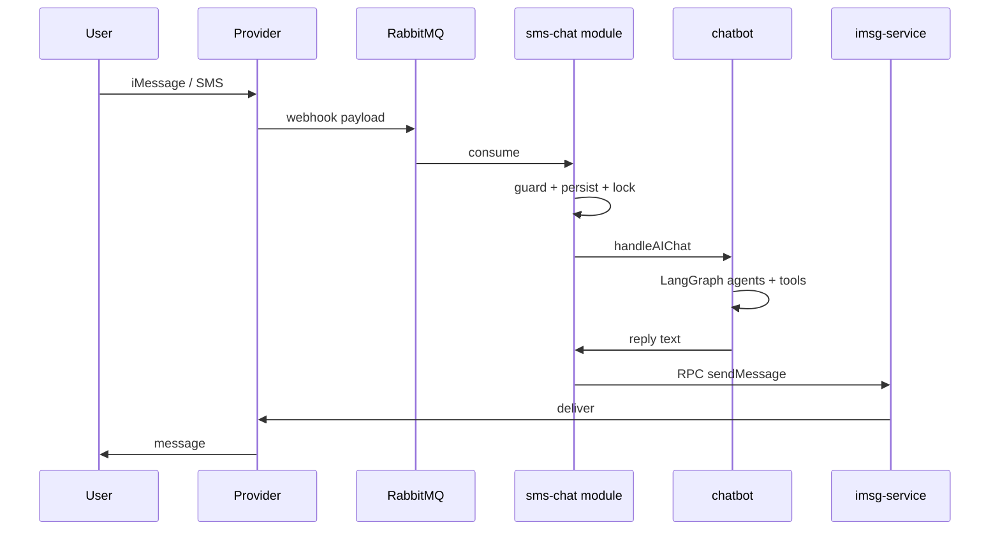

# SMS / iMessage pipeline

End-to-end flow for conversational SMS (production). See [../architecture/chatbot.md](../architecture/chatbot.md) for agent detail.

## Operational risks

| Stage | Risk |
|-------|------|
| Consume | Early ACK before parse → lost message on malformed payload |
| Guard | Malicious check timeout → treated as safe |
| Graph | Full compile per message → latency |
| Send | RPC timeout, no retry → silent drop |

Mitigations are tracked in [../docs/chatbot/production-audit.md](../docs/chatbot/production-audit.md).
