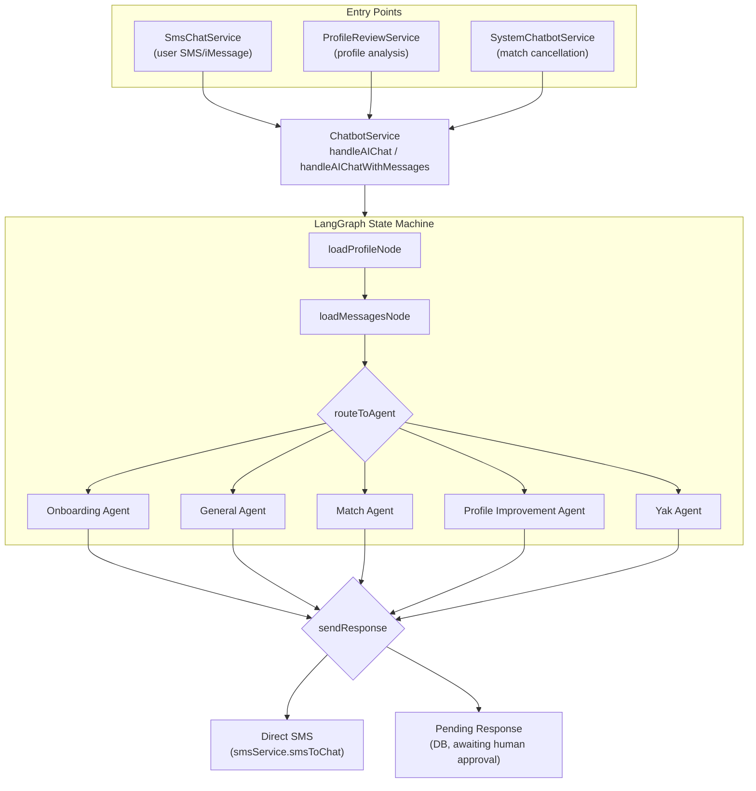
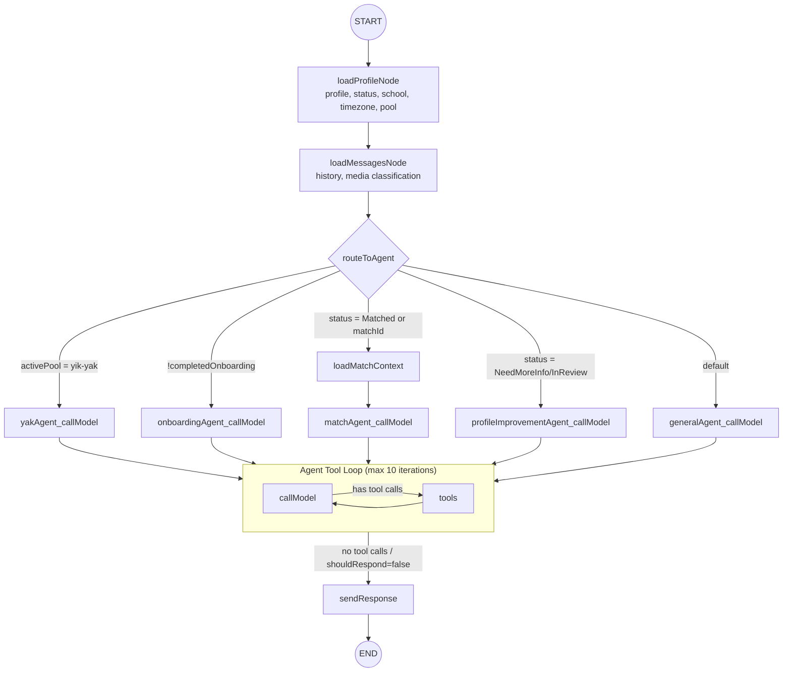
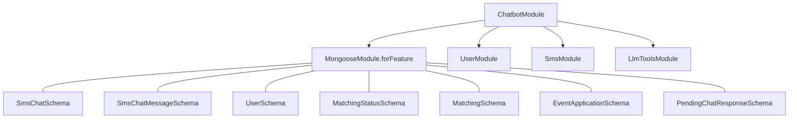

# Chatbot - Conversation AI System Overview

# Chatbot System — Engineering Overview

This document provides a comprehensive overview of the chatbot system for onboarding engineers. The chatbot is an AI-powered conversational assistant that communicates with users via SMS/iMessage and is built on top of **LangGraph** (a state-machine framework from LangChain).

---

## Table of Contents

1. [High-Level Architecture](about:blank#high-level-architecture)
2. [File Structure](about:blank#file-structure)
3. [How a Message Is Processed](about:blank#how-a-message-is-processed)
4. [The LangGraph State Machine](about:blank#the-langgraph-state-machine)
5. [Agents](about:blank#agents)
6. [Agent Routing Logic](about:blank#agent-routing-logic)
7. [Tools (LLM Function Calling)](about:blank#tools-llm-function-calling)
8. [State & State Reminders](about:blank#state--state-reminders)
9. [Data Loading Nodes](about:blank#data-loading-nodes)
10. [Response Delivery](about:blank#response-delivery)
11. [Middleware](about:blank#middleware)
12. [Checkpointing & Conversation Memory](about:blank#checkpointing--conversation-memory)
13. [LLM Provider Integration](about:blank#llm-provider-integration)
14. [Prompt Management](about:blank#prompt-management)
15. [Configuration](about:blank#configuration)
16. [Entry Points & Callers](about:blank#entry-points--callers)
17. [Key Dependencies](about:blank#key-dependencies)
18. [Testing](about:blank#testing)
19. [Debugging & Observability](about:blank#debugging--observability)

---

## High-Level Architecture



---

## File Structure

```
src/chatbot/
├── agents/
│   ├── data-loader.ts              # loadProfileNode, loadMessagesNode
│   ├── general-agent.ts            # Post-onboarding, non-matched users
│   ├── match-agent.ts              # Matched users + loadMatchContext
│   ├── onboarding-agent.ts         # Users who haven't finished onboarding
│   ├── profile-improvement-agent.ts # Users with profile issues (NeedMoreInfo/InReview)
│   └── yak-agent.ts                # Yik Yak pool users
├── model/
│   └── graph-dependencies.ts       # GraphDependencies interface + LLM factory
├── chatbot-tests/
│   ├── agent-node.spec.ts
│   ├── chatbot-tools.spec.ts
│   └── data-loader.spec.ts
├── chatbot-graph.ts                # LangGraph state machine definition
├── chatbot-graph-standalone.ts     # Simplified graph for LangGraph Studio
├── chatbot-state.ts                # ChatbotStateAnnotation (typed state schema)
├── chatbot.module.ts               # NestJS module definition
├── chatbot.service.ts              # Main service (graph compilation + invocation)
├── chatbot-tools.ts                # Tool definitions for LLM function calling
├── chatbot-tools-schema.ts         # Zod schemas for tool parameters
├── chatbot.utils.ts                # Helpers (e.g. isOlderUser)
├── chatbot.messages.ts             # Static message templates & constants
├── chatbot.middleware.ts           # Security checks (malicious content, emoji reactions)
├── state-reminder.ts               # State reminder message builders
└── system-invocation.types.ts      # SystemInvocationContext type
```

---

## How a Message Is Processed

Here is the end-to-end flow when a user sends an SMS:

1. **Webhook** → `SmsChatService` receives the incoming message and persists it to MongoDB (`sms_chat_messages`).
2. **SmsChatService** calls `ChatbotService.handleAIChat()` with:
    - The message body (`IMessageIncomeEvent`)
    - The chat document (`SmsChatDocument`)
    - Optional `SystemInvocationContext` (for system-triggered runs)
3. **ChatbotService** performs setup:
    - Validates the user exists
    - Handles image uploads (attaches media URLs to the latest message)
    - Calls `buildAgentGraph(deps)` to construct the LangGraph state machine
    - Compiles the graph with a `MongoDBSaver` checkpointer for conversation memory
    - Invokes the compiled graph with the initial state
4. **LangGraph execution** (see [The LangGraph State Machine](about:blank#the-langgraph-state-machine)):
    - `loadProfileNode` — loads user profile, status, school, timezone
    - `loadMessagesNode` — loads/rebuilds conversation history
    - `routeToAgent` — selects the appropriate agent
    - `{agent}_callModel` ↔︎ `{agent}_tools` — LLM call + tool execution loop
    - `sendResponse` — delivers the AI reply
5. **Post-processing**: LangSmith run IDs are stamped on assistant messages and pending responses for traceability.

---

## The LangGraph State Machine

The graph is built in `chatbot-graph.ts` via `buildAgentGraph()`. It uses LangGraph’s `StateGraph` API with typed state annotations.

### Graph Topology



### Agent Node Pattern

Each agent is split into two graph nodes, built by `buildAgentNodes()`:

| Node | Responsibility |
| --- | --- |
| `{agent}_callModel` | Invokes the LLM with bound tools, system prompt, and state reminder |
| `{agent}_tools` | Executes any tool calls the LLM requested (via `ToolNode`) |

Routing functions control the loop:

- **`shouldContinue`**: After `callModel`, checks if the LLM returned tool calls. If yes → route to `{agent}_tools`. If no → route to `sendResponse`. If `shouldRespond === false` → route to `END`.
- **`afterTools`**: After tool execution, routes back to `callModel` to let the LLM process tool results. If `shouldRespond === false` → route to `END` (a tool like `handOverToTeam` stopped the agent).

The loop is capped at **10 iterations** to prevent runaway tool-call chains. On hitting the cap, a fallback action runs (typically `handOverToTeam`).

---

## Agents

Each agent handles a specific user lifecycle stage. All agents share the same structural pattern but differ in their system prompt, available tools, and state reminder format.

### General Agent

- **File**: `agents/general-agent.ts`
- **Prompt path**: `/chatbot/general-agent`
- **When used**: Post-onboarding users who are not currently matched (status: Waiting, Paused, etc.)
- **Tools**: Full suite — pause/resume account, matchmaking updates, profile updates, login links, social handles, handover to team, account deactivation, poster link, pool switching
- **State reminder**: Today’s date, user status, school, sign-up year, profile summary

### Match Agent

- **File**: `agents/match-agent.ts`
- **Prompt path**: `/chatbot/match-agent`
- **When used**: Users with status “Matched” or when a `matchId` is provided (e.g., match cancellation)
- **Extra data loading**: `loadMatchContext` node runs first to fetch match details (matched user name, match status, scheduling state)
- **Tools**: General tools PLUS match-specific tools — match info, match poster, scheduling link, mark not going, trigger contact exchange. Some tools are gated on match phase (pre-reveal vs. post-reveal)
- **State reminder**: Match status, matched user name, scheduling info

### Onboarding Agent

- **File**: `agents/onboarding-agent.ts`
- **Prompt path**: `/chatbot/user-onboarding`
- **When used**: Users who haven’t completed onboarding (`completedOnboarding === false`)
- **Tools**: Minimal — login link, social handles, handover, no-reply
- **State reminder**: Today’s date, user status, school, profile summary

### Profile Improvement Agent

- **File**: `agents/profile-improvement-agent.ts`
- **Prompt path**: `/chatbot/profile-improvement-agent`
- **When used**: Users with status “NeedMoreInfo” or “InReview” (profile has issues that need fixing)
- **Tools**: Profile-focused — update profile fields, update images, pause/resume, handover, deactivation
- **State reminder**: Profile issues list, formatted profile (without deep-info fields to avoid bias)

### Yak Agent

- **File**: `agents/yak-agent.ts`
- **Prompt path**: `/chatbot/yak-agent`
- **When used**: Users in the Yik Yak pool (`activePool === "yik-yak"`)
- **Tools**: Profile tools, image management, email verification, pool switching, pause/opt-out
- **State reminder**: Pool context, profile image count, pool-specific info

---

## Agent Routing Logic

Routing happens in `routeToAgent()` in `chatbot-graph.ts`. The priority order:

| Priority | Condition | Target Agent |
| --- | --- | --- |
| 1 | `activePool === "yik-yak"` | Yak Agent |
| 2 | `completedOnboarding === false` | Onboarding Agent |
| 3 | `currentStatus === "Matched"` or `matchId` is set | Match Agent (via `loadMatchContext`) |
| 4 | `currentStatus === "NeedMoreInfo"` or `"InReview"` | Profile Improvement Agent |
| 5 | Everything else | General Agent |

---

## Tools (LLM Function Calling)

Tools are defined in `chatbot-tools.ts` via `createTools()`. Each tool is a LangChain `tool()` that the LLM can call. Tools are grouped into sets, and each agent gets a specific subset.

### Tool Categories

**Account Management:**
- `pauseUserAccount` / `resumeUserAccount` — toggle account pause state
- `requestAccountDeactivation` / `confirmAccountDeactivation` — two-step deactivation flow
- `pauseMatchedUserAccount` — pause while matched (match-agent only)

**Profile:**
- `updateUserProfile` — update profile fields (uses Zod schema for validation)
- `getProfileUpdateInfo` — get current profile for reference
- `unsetUserProfileFields` — remove specific profile fields
- `updateUserProfileImage` / `updateUserIdealDateImage` — image updates
- `getUserPosterLink` / `getMatchPosterLink` — generate shareable poster URLs

**Match:**
- `getMatchInfo` — fetch match details
- `getMatchingHistory` — past matches
- `getMatchScheduleLink` — scheduling page URL
- `markNotGoing` — decline a match
- `triggerContactExchange` — initiate contact sharing

**Communication:**
- `getLoginLink` — generate a magic login link
- `getDittoSocialMediaHandles` — return social media links
- `handOverToTeam` — escalate to a human (sets `shouldRespond: false`)
- `noReply` — signal no response needed

**Matchmaking:**
- `getMatchmakingUpdate` — current matchmaking status/position
- `switchPool` — move user between matching pools

**Yak-Specific:**
- `sendEmailVerificationCode` / `verifyEmailCode` — email verification flow
- `getProfileImageList` / `deleteProfileImages` — image management
- `pauseUserAccountYak` — yak-specific pause

### Tool → State Updates

Tools can return a `Command` object to update graph state. Common patterns:
- `handOverToTeam` sets `shouldRespond: false` → the loop exits without sending a response
- Profile tools update `profileSummary` so subsequent LLM calls see fresh data
- Match tools update `matchStatus` after actions like `markNotGoing`

---

## State & State Reminders

### Graph State (`chatbot-state.ts`)

The `ChatbotStateAnnotation` defines all state the graph carries through execution:

| Category | Fields |
| --- | --- |
| **Messages** | `messages` (LangChain message list with reducer for append/update) |
| **Identity** | `chatId`, `userId` |
| **Input** | `incomingMessageContent`, `incomingMediaUrls` |
| **Profile** | `profileSummary`, `poolInfo`, `profileIssues`, `profileImageCount` |
| **User Context** | `currentStatus`, `completedOnboarding`, `school`, `timezone`, `signUpYear`, `emailVerified` |
| **Match** | `matchId`, `matchedUserName`, `matchStatus`, `hasUserPickedTime` |
| **Control Flow** | `shouldRespond`, `toolCallIterations`, `sendSuppressed` |
| **System** | `systemMessage`, `invocationStartedAt`, `pendingResponseTimestamp` |
| **Pool** | `activePool`, `isInLaLoveYachtPool`, `loveYachtPlacement` |
| **Debug** | `error`, `agentSteps` |

### State Reminders (`state-reminder.ts`)

State reminders are system messages injected as trailing context so the LLM has access to **current, authoritative** data instead of relying on potentially stale conversation history. They are rebuilt on every invocation.

| Builder Function | Used By | Content |
| --- | --- | --- |
| `buildStateReminderMessageContent` | General, Onboarding | Today’s date, status, school, sign-up year, profile summary, stage-specific notes |
| `buildProfileImprovementStateReminderMessageContent` | Profile Improvement | Profile issues list, formatted profile (deep-info stripped) |
| `buildMatchStateReminderMessageContent` | Match | Match status, matched user info, scheduling state |
| `buildYakStateReminderMessageContent` | Yak | Pool context, profile image count, pool-specific data |

State reminders are **stripped from messages before checkpointing** (`stripStateReminderFromMessages()`) so they don’t accumulate across turns.

---

## Data Loading Nodes

### `loadProfileNode` (`agents/data-loader.ts`)

Runs first in every invocation. Loads:
- User profile via `UserService.getProfile()`
- Matching status from MongoDB
- School name and timezone
- Active pool and Love Yacht placement
- Profile issues (when status is `NeedMoreInfo`)
- Serializes profile into `profileSummary` JSON for the LLM

### `loadMessagesNode` (`agents/data-loader.ts`)

Runs after profile loading. Handles:
- **Media classification**: checks if attached URLs are supported image types and reachable
- **URL masking**: replaces invalid image URLs in message text
- **History reconstruction**: uses checkpoint history if available, otherwise loads the last 20 messages from MongoDB
- **Expired image cleanup**: strips expired `image_url` content parts from checkpointed messages
- **Deduplication**: appends the new incoming message, avoiding duplicates

### `loadMatchContext` (`agents/match-agent.ts`)

Only runs for the Match Agent path. Loads:
- Active match record from MongoDB
- Matched user’s name
- Match status string (e.g., “EmailSent 2/2”, “TimeScheduled 1/2”)
- Whether the user has already picked a time slot

---

## Response Delivery

The `sendResponse` node in `chatbot-graph.ts` handles getting the AI’s reply to the user.

### Quiet Check (Anti-Double-Texting)

Before sending, `sendResponse` checks if new user messages arrived in MongoDB after `invocationStartedAt`. If so, the response is **suppressed** and `sendSuppressed` is set to `true`. The outer retry loop in `SmsChatService` detects this and re-invokes the chatbot with the latest messages.

### Delivery Modes

| Mode | When | Behavior |
| --- | --- | --- |
| **Direct SMS** | `pendingResponsesEnabled === false` AND response < 3000 chars | Sends each line as a separate SMS with typing indicators between them |
| **Pending Response** | `pendingResponsesEnabled === true` OR response >= 3000 chars | Creates `PendingChatResponse` records in MongoDB for human review/approval |

### Message Splitting

Responses are split by newlines into separate message parts. Each non-empty line becomes its own SMS or pending response entry.

### Special Case: “not responding”

If the LLM outputs exactly `"not responding"`, the bot silently skips sending — used when the agent determines no reply is appropriate.

---

## Middleware

Defined in `chatbot.middleware.ts`, applied inside each agent’s `callModel` node before the LLM call:

### Malicious Content Check

- Runs `validateAndSanitizeInput()` on the last user message
- If flagged as malicious, returns a canned error response (`CHATBOT_MESSAGES.unsafeInputError`) and stops processing
- Prevents prompt injection and other adversarial inputs

### Emoji Reaction Check

- Detects iMessage reaction patterns (e.g., `Loved "hello"`, `Laughed at "hey"`)
- If the incoming message is just a reaction, the agent skips processing (no LLM call)

---

## Checkpointing & Conversation Memory

The chatbot uses **MongoDB-based checkpointing** via LangGraph’s `MongoDBSaver`:

- **Database**: `langgraph` (separate from the main app database)
- **Collections**: `checkpoints`, `checkpoint_writes`
- **Thread ID**: Each conversation uses the `chatId` as its thread ID
- **Indexes**: Created in `ChatbotService.onModuleInit()` for performance

On each invocation, the checkpointer restores the previous conversation state (messages, metadata). After the graph finishes, the new state is persisted.

**Checkpoint hygiene**: State reminders and expired `image_url` parts are stripped before persisting to keep checkpoints clean and avoid context bloat.

---

## LLM Provider Integration

### Vercel AI Gateway

All LLM calls route through [Vercel AI Gateway](https://ai-gateway.vercel.sh/v1), which provides a unified OpenAI-compatible endpoint for multiple providers.

**Factory**: `createLlmFromPrompt()` in `model/graph-dependencies.ts`:
- Takes a `PromptConfig` with `model`, `provider`, and `temperature`
- Constructs a `ChatOpenAI` instance (from `@langchain/openai`) pointing at the gateway
- Model strings follow `provider/model-name` format (e.g., `anthropic/claude-3-sonnet`)
- Injects `ls_provider` and `ls_model_name` metadata for LangSmith cost tracking

### API Key

The `AI_GATEWAY_API_KEY` environment variable (set from config `aiGatewayKey`) authenticates requests to the gateway.

---

## Prompt Management

Prompts are **not hardcoded**. They’re fetched at runtime from a `PromptClient` service:

| Agent | Prompt Path |
| --- | --- |
| General | `/chatbot/general-agent` |
| Match | `/chatbot/match-agent` |
| Onboarding | `/chatbot/user-onboarding` |
| Profile Improvement | `/chatbot/profile-improvement-agent` |
| Yak | `/chatbot/yak-agent` |

Each prompt includes:
- **System prompt template** with variables (e.g., `{profile}`, `{issues}`, `{matchStatus}`)
- **Model configuration**: provider, model name, temperature
- **Special instructions**: dynamic notes injected per-agent

Prompts are cached per invocation to avoid redundant fetches.

---

## Configuration

### TOML Config

```toml
aiGatewayKey = "..."          # Vercel AI Gateway API key

[langsmith]
tracing = true                 # Enable/disable LangSmith tracing
endpoint = "https://api.smith.langchain.com"
apiKey = "lsv2_pt_..."        # LangSmith API key
project = "Ditto-Chatbot-Dev" # LangSmith project name
projectId = "..."             # LangSmith project ID
```

### Environment Variables (set from config in `ChatbotService` constructor)

| Variable | Purpose |
| --- | --- |
| `AI_GATEWAY_API_KEY` | Vercel AI Gateway authentication |
| `LANGCHAIN_TRACING_V2` | Enable LangSmith tracing |
| `LANGCHAIN_ENDPOINT` | LangSmith API endpoint |
| `LANGCHAIN_API_KEY` | LangSmith API key |
| `LANGCHAIN_PROJECT` | LangSmith project name |

---

## Entry Points & Callers

The chatbot has **no HTTP controller**. It is invoked internally by other services:

| Caller | Method | Trigger |
| --- | --- | --- |
| **SmsChatService** | `handleAIChat()` | User sends SMS/iMessage (non-login, non-referral) |
| **SmsChatService** | `handleAIChatWithMessages()` | Re-run from internal API with selected messages |
| **ProfileReviewService** | `handleAIChat()` | After automated profile analysis, with `systemContext: { kind: "profile_review" }` |
| **ChatbotService** (self) | `handleAIChat()` | Match cancellation via `@OnEvent(MATCH_CANCELLATION_NOTIFY)`, with `systemContext: { kind: "match" }` |

### System Invocation Contexts

```tsx
type SystemInvocationContext =
  | { kind: "profile_review"; profileIssues: string[]; systemMessage?: string }
  | { kind: "match"; systemMessage: string; matchId: string };
```

When a `systemContext` is provided, the agent treats the run as system-triggered (proactive outreach) rather than user-initiated.

---

## Key Dependencies

### NestJS Module Imports



### Service Dependencies (`GraphDependencies` interface)

| Dependency | Role |
| --- | --- |
| `PromptClient` | Fetch agent prompts and model config |
| `SmsService` | Send SMS messages to users |
| `LlmToolsService` | Business logic for all LLM tools (profile updates, match actions, etc.) |
| `ProfileClient` | Profile data formatting and issue detection |
| `UserService` | User profile, school, timezone, pool info |
| `WinstonLoggerService` | Structured logging |
| MongoDB Models | `SmsChatModel`, `SmsChatMessageModel`, `UserModel`, `MatchingModel`, `MatchingStatusModel`, `PendingChatResponseModel` |

### External Packages

| Package | Usage |
| --- | --- |
| `@langchain/langgraph` | State machine framework (StateGraph, Annotation, ToolNode) |
| `@langchain/openai` | ChatOpenAI LLM client |
| `@langchain/langgraph-checkpoint-mongodb` | MongoDBSaver for conversation persistence |
| `langsmith` | Tracing and observability |
| `@dodo-world/proj-coach-schemas` | Shared MongoDB schema types |
| `zod` | Tool parameter validation schemas |

---

## Testing

Tests live in `src/chatbot/chatbot-tests/`:

| Test File | Coverage |
| --- | --- |
| `agent-node.spec.ts` | Agent node construction, callModel/shouldContinue/afterTools behavior |
| `chatbot-tools.spec.ts` | Tool definitions, parameter validation, state updates |
| `data-loader.spec.ts` | Profile loading, message loading, media classification |

Run tests:

```bash
bun run test                    # All tests
bun run test -- --testPathPattern=chatbot  # Chatbot tests only
```

---

## Debugging & Observability

### LangSmith

Every graph invocation is traced in [LangSmith](https://smith.langchain.com/). Each trace includes:
- Full message history sent to the LLM
- Tool calls and their results
- Token usage and cost
- Latency per node

LangSmith run IDs are stamped on `sms_chat_messages` (field: `langsmithRunId`) so you can jump from a message in MongoDB to its full trace.

### System Messages for Tool Calls

Every tool call is logged as a `system` type message in `sms_chat_messages` with the format:

```
[Tool Call] toolName: {"arg": "value"}
[Tool Call - FAILED] toolName: {"arg": "value"}
```

### Winston Logging

Key log points:
- Graph invocation start/end
- Agent routing decisions
- Tool call execution
- Response delivery (direct vs. pending)
- Quiet-check results (suppressed sends)
- Errors at any stage

### LangGraph Studio

`chatbot-graph-standalone.ts` provides a simplified version of the graph for use with [LangGraph Studio](https://github.com/langchain-ai/langgraph-studio), a visual debugger for LangGraph state machines.

---

## Common Scenarios

### User sends a message while waiting for a match

1. SMS → SmsChatService → ChatbotService
2. loadProfile: status = “Waiting”, completedOnboarding = true
3. Route → General Agent
4. LLM responds with encouragement, can use `getMatchmakingUpdate` if asked

### User matched — system notifies about cancellation

1. LlmToolsService → SystemChatbotService emits `MATCH_CANCELLATION_NOTIFY`
2. ChatbotService handles event → `handleAIChat()` with `systemContext: { kind: "match", matchId, systemMessage }`
3. loadProfile: status still “Matched”
4. Route → Match Agent
5. LLM uses the system message to inform the user about the cancellation

### Profile review finds issues

1. ProfileReviewService → `handleAIChat()` with `systemContext: { kind: "profile_review", profileIssues }`
2. loadProfile: status = “NeedMoreInfo”
3. Route → Profile Improvement Agent
4. LLM guides user through fixing the flagged issues

### User sends a message but another arrives during processing

1. First message triggers graph invocation
2. During LLM processing, user sends a second message
3. `sendResponse` quiet-check detects the new message → sets `sendSuppressed: true`
4. SmsChatService retry loop re-invokes the chatbot with all messages
5. The response now accounts for both messages