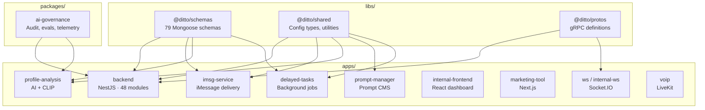
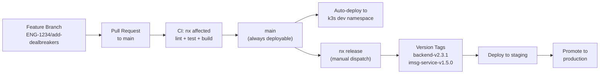
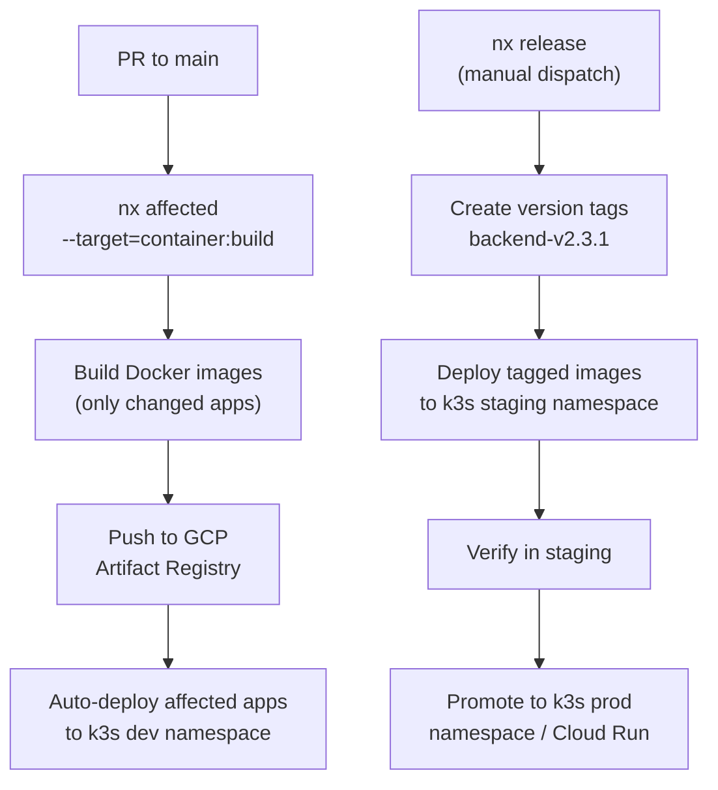
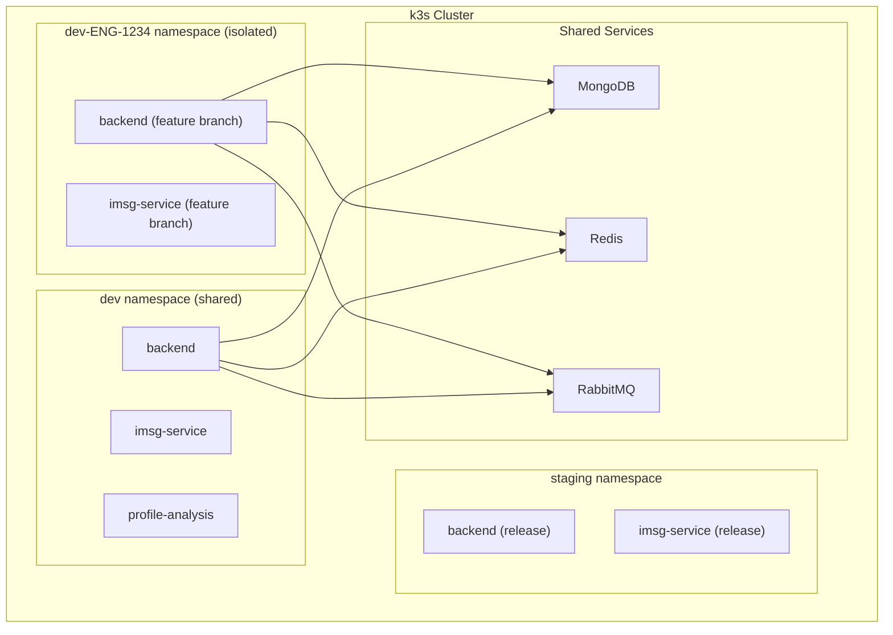

# RFC: Monorepo-Driven Development — Ship Q2 3x Faster

| Field | Value |
| --- | --- |
| **Author** | Ryan Willis / Ditto Engineering |
| **Date** | April 2026 |
| **Status** | Proposal |
| **Team** | Engineering |

---

# 1. Executive Summary

<aside>
🚀

Ditto runs 18 separate repositories. Seven of our eleven Q2 initiatives require coordinated changes across 3 or more of them. Every cross-repo change — adding a schema field, landing a chatbot refactor, wiring up the new User Memory system — costs us hours of tag-publish-install cycles, multi-PR coordination, and deployment prayers. **The monorepo is the single highest-leverage move we can make for Q2.**

</aside>

Our Q2 theme is **Deepen Quality → Scale → Summer Launch**. Priority #3 is explicit: *iterate 3x faster*. But the multi-repo architecture is the bottleneck. A single field addition to `@dodo-world/proj-coach-schemas` requires tagging, publishing, updating 5 consumer repos, and 5 separate PRs — roughly 2 hours of mechanical work for what should be a 15-minute change. The chatbot skills refactor (ENG-1518) touches 3 repos simultaneously. The matchmaker v2 dealbreaker layer spans backend, profile-analysis, and schemas. Every initiative fights the same friction.

This RFC proposes consolidating all 18 repositories into a single **Nx monorepo**. Nx is a polyglot build system supporting TypeScript, Python, and Go — all three languages in our stack. It provides affected-build detection (only rebuild what changed), remote caching, independent versioning with conventional commits, and a project dependency graph. Meta, Google, OpenAI, Vercel, and Stripe all run monorepos. OpenAI specifically consolidated from multi-repo to monorepo because AI products require prompts, evals, model configs, and application code to stay in sync — the exact same challenge Ditto faces. With a principal engineer experienced in monorepo tooling, migration takes **3–5 days**.

---

# 2. The Problem: Why 18 Repos Is Costing Us Q2

## 2.1 The Schema Tax

`@dodo-world/proj-coach-schemas` contains **79 Mongoose schema files** and is consumed by 5 services: `proj-coach-backend`, `imsg-service`, `profile-analysis-service`, `delayed-task-service`, and event tooling. It is published as an npm package via GitHub Packages.

**Adding a single field today requires:**

1. PR to `proj-coach-schemas` → review → merge
2. `git tag v0.12.x` → wait for GitHub Packages publish
3. `bun install @dodo-world/proj-coach-schemas@0.12.x` in each of the 5 consumer repos
4. PR in each consumer repo → review → merge → deploy

That's **6+ PRs** and roughly **2 hours** for a one-line schema change. Now consider Initiative 2 (User Memory) — it will add new schema fields that the backend, profile-analysis-service, and chatbot all need simultaneously. Under the current setup, that's a multi-day coordination exercise.

## 2.2 CI/CD Multiplication

We maintain **13 separate GitHub Actions workflow directories** across repos. Naming is inconsistent: some repos use `build-docker.yml`, others `build-dev.yaml` (even the file extension differs). Each repo has its own Dockerfile, its own build triggers, its own deployment curl to `deploy.internal.ditto.ai`. There is no shared CI pipeline definition. When we need to change how builds work, we change it 13 times.

## 2.3 Context Switching Cost

- **CLAUDE.md files exist in only 9 of 17 repos.** AI coding tools (Claude Code, Cursor) must be re-contextualized per repo — and 8 repos have no AI context at all.
- Each repo has its own `tsconfig.json`, `eslint.config.js`, `bunfig.toml` with slightly different configs.
- Developers maintain separate terminal sessions, separate git states, separate branch strategies per repo.
- There is **no way to do atomic cross-repo refactors**. The chatbot skills refactor (ENG-1518) touches `proj-coach-backend`, `prompt-manager-backend`, and `proj-coach-schemas` simultaneously — but today, these are 3 separate PRs that must be merged in the right order.

## 2.4 Dependency Version Drift

Shared dependencies — `mongoose`, `ioredis`, `amqplib`, the Vercel AI SDK — may be at different versions across repos. There is no mechanism to enforce consistency. A bug caused by version mismatch between backend and iMessage service is invisible until production.

## 2.5 Single Shared Dev Environment

All engineers and QA share a single dev environment. When one engineer deploys a broken backend to dev, everyone is blocked. There is no way to test changes in isolation before merging.

## 2.6 Before/After: Developer Experience

| Scenario | Today (18 repos) | Monorepo |
| --- | --- | --- |
| Add a field to user schema | 6+ PRs, ~2 hours, publish cycle | 1 PR, ~15 min, immediate |
| Cross-service refactor (e.g. chatbot skills ENG-1518) | 3+ repos, 3+ PRs, merge order matters | 1 PR, atomic commit |
| New engineer onboarding | Clone 5+ repos, configure each separately | Clone 1 repo, `bun install`, done |
| CI pipeline maintenance | 13 separate workflow dirs, inconsistent | 3 shared workflow files |
| Run all affected tests | Manual, per-repo, hope you remember which ones | Automatic via `nx affected --target=test` |
| Claude Code / Cursor context | Per-repo CLAUDE.md (53% coverage), no cross-repo understanding | Full codebase context, hierarchical CLAUDE.md (100% coverage) |
| Bug requires backend + iMessage fix | 2 PRs, 2 reviews, 2 deploys, hope they're compatible | 1 PR, 1 review, guaranteed compatible deploy |
| Dependency upgrade (e.g. mongoose 9) | Update in each of 5+ repos separately, test separately | Update once at root, `nx affected --target=test` validates all consumers |

---

# 3. Industry Precedent — Why the Best Teams Use Monorepos

## 3.1 Meta (Facebook)

Meta maintains its entire codebase in a single Mercurial monorepo. Tens of thousands of engineers commit to it daily. They built the Buck build system specifically because the benefits of atomic commits and shared code outweighed the tooling investment. Key insight: *"The monorepo enables us to make large-scale changes across the entire codebase atomically."*

## 3.2 Google

Google's monorepo contains billions of lines of code. They built Bazel specifically for monorepo-scale builds. All services share types, protobuf definitions, and configuration. The monorepo is cited as a key enabler of Google's ability to refactor infrastructure at scale.

## 3.3 OpenAI

OpenAI consolidated from multi-repo to monorepo as they scaled from GPT-3 to GPT-4 development. The reason: AI products require **prompts, evals, model configs, safety systems, and application code to change together**. A prompt change that isn't tested against the eval suite is a regression risk. A model config change that doesn't update the safety guardrails is a safety risk.

**This is directly parallel to Ditto.** Our chatbot prompts, eval suites, matchmaker scoring logic, and User Memory extraction must evolve in lockstep. Today they live in separate repos with no mechanism to enforce consistency.

## 3.4 Vercel

The Vercel AI SDK — the very SDK we are adopting for the chatbot skills refactor (ENG-1518) — is developed in a monorepo. Next.js, Turbopack, and all Vercel infrastructure live in one repo. They built Turborepo specifically to solve the monorepo orchestration problem.

## 3.5 Stripe

Stripe maintains a single monorepo for all services. API changes, documentation, and client libraries ship atomically. Their key insight is relevant to Ditto: webhook handling must stay in sync with API changes — just like our iMessage webhook handling must stay in sync with backend changes.

<aside>
💡

We are not proposing building Meta-scale custom tooling. We are proposing using **Nx** — a proven, industry-standard monorepo tool with polyglot support for TypeScript, Python, and Go — the three languages in our stack.

</aside>

---

# 4. Initiative-by-Initiative Impact Map

| # | Q2 Initiative | Repos Affected Today | Monorepo Benefit | Impact |
| --- | --- | --- | --- | --- |
| 1 | **Summer Launch** (cross-school matching) | proj-coach-backend, profile-analysis-service, proj-coach-schemas, ditto-internal-frontend | Algorithm + schema + frontend changes land in 1 PR. No version drift between matching algorithm and schema. | 🔴 HIGH |
| 2 | **User Memory System** | proj-coach-backend, profile-analysis-service, proj-coach-schemas, prompt-manager-backend | New memory schemas, extraction logic, chatbot integration, and matchmaker consumption — all in one atomic change. Currently 4+ PRs across 4 repos. | 🔴 CRITICAL |
| 3 | **Chatbot Improvements** (Skills Refactor, ENG-1518) | proj-coach-backend, prompt-manager-backend, proj-coach-schemas | Migrating from LangGraph to Vercel AI SDK with skills architecture requires simultaneous changes to chatbot code, prompt service, and schemas. Monorepo = single branch. | 🔴 CRITICAL |
| 4 | **Matchmaker V2** (dealbreakers, trust scores) | proj-coach-backend, profile-analysis-service, matchmake_experimentation, proj-coach-schemas | Dealbreaker layer, trust scores, and cross-school algorithm span backend + analysis + schemas. Eval framework shares test fixtures. | 🔴 HIGH |
| 5 | **iMessage Engagement & Follow-up** | imsg-service, proj-coach-backend, delayed-task-service | Smart timing and follow-up flows require coordinated changes between iMessage delivery, backend logic, and delayed task scheduling. | 🟡 MEDIUM |
| 6 | **Engineering Velocity** (3x faster iteration) | ALL repos | **This initiative IS the monorepo.** Shared CI, shared lint, shared types, faster PR-to-prod, easier onboarding, per-PR testing slots. | 🔴 CRITICAL |
| 7 | **Metrics & Analytics** | proj-coach-backend, ditto-internal-frontend, otel | Shared telemetry types, dashboard components, and event definitions in one place. Data pipeline changes validated against all consumers. | 🟡 MEDIUM |
| 8 | **Product Experiments** (Double Dates, etc.) | proj-coach-backend, ditto-internal-frontend | Feature flags and experiment code live alongside the features they toggle. Experiment setup is 1 PR, not 2. | 🟡 MEDIUM |
| 9 | **Internal Agent** (OpenClaw / Company Jarvis) | claude-marketplace, proj-coach-backend | Agent has full codebase context in one repo. Code skills, ops skills, and knowledge docs are co-located. Single index for codebase Q&A. | 🔴 HIGH |
| 10 | **Influencer Campaign** | marketing-internal-tool, ditto-internal-frontend | Shared component library between internal tools. | 🟢 LOW |
| 11 | **Canada Expansion** | proj-coach-backend, proj-coach-schemas | School/pool config + schema updates are atomic. | 🟢 LOW |

<aside>
📊

**7 of 11 Q2 initiatives require coordinated changes across 3+ repositories.** Three of these are rated CRITICAL — they cannot move at full speed under the current multi-repo setup.

</aside>

---

# 5. Proposed Monorepo Architecture

## 5.1 Directory Structure

```
ditto/
├── nx.json                         # Nx workspace config
├── package.json                    # Root workspace + scripts
├── bun.lock                        # Single lockfile
├── tsconfig.base.json              # Shared TypeScript config
├── eslint.config.js                # Shared lint config
├── CLAUDE.md                       # Root AI context (architecture overview)
│
├── .github/
│   └── workflows/
│       ├── pr-build.yml            # PR CI: lint, test, build affected
│       ├── release.yml             # Staging/prod release via nx release
│       └── cleanup.yml             # Auto-cleanup branch slots on merge
│
├── apps/
│   ├── backend/                    # proj-coach-backend (NestJS, 48 modules)
│   ├── imsg-service/               # iMessage delivery (NestJS)
│   ├── profile-analysis/           # AI analysis + CLIP (NestJS)
│   ├── prompt-manager/             # Prompt CMS (NestJS)
│   ├── delayed-tasks/              # Scheduled task execution (NestJS)
│   ├── internal-frontend/          # Admin dashboard (React/Vite)
│   ├── marketing-tool/             # Poster generation (Next.js)
│   ├── ws/                         # User WebSocket (Socket.IO)
│   ├── internal-ws/                # Admin WebSocket (Socket.IO)
│   ├── voip/                       # Voice coaching (LiveKit)
│   └── otel-collector/             # OpenTelemetry distribution (Go)
│
├── libs/
│   ├── schemas/                    # @ditto/schemas (79 Mongoose schemas)
│   ├── shared/                     # @ditto/shared (config types, utilities)
│   └── protos/                     # @ditto/protos (gRPC definitions)
│
├── packages/
│   └── ai-governance/              # Prompt auditing, eval framework, telemetry
│
├── ai/
│   ├── prompts/                    # Version-controlled prompt templates
│   │   ├── chatbot/                # Skills: onboarding, match, general, profile
│   │   ├── matchmaker/             # Scoring, analysis prompts
│   │   └── templates/              # Email, SMS templates
│   ├── evals/                      # Evaluation suites
│   │   ├── chatbot/                # Conversation quality scenarios
│   │   └── matchmaker/             # Match outcome regression
│   └── playbook/                   # Self-learning chatbot handbook
│
├── tools/
│   ├── matchmake-experimentation/  # R&D notebooks (Python)
│   ├── ufl/                        # Synthetic data generation (Python)
│   ├── claude-marketplace/         # Claude Code plugins
│   └── event-yikyak/              # Event tooling
│
└── docs/                           # Architecture, roadmap, proposals
```

## 5.2 Dependency Graph



## 5.3 Package → Consumer Mapping

| Package | Consumers | Note |
| --- | --- | --- |
| `@ditto/schemas` | backend, imsg-service, profile-analysis, delayed-tasks | Was npm package → now `workspace:*` (zero publish cycle) |
| `@ditto/shared` | backend, imsg-service, profile-analysis, prompt-manager, delayed-tasks | New: shared config types and utilities |
| `@ditto/protos` | backend, ws, internal-ws | gRPC auth definitions |
| `ai-governance` | backend, profile-analysis | Prompt auditing, eval framework |

<aside>
⚡

The critical change: `@ditto/schemas` moves from a published npm package with a tag-publish-install cycle to a **workspace dependency** (`workspace:*`). Schema changes are instantly available to all consumers — no publishing, no version bumping, no waiting. This alone eliminates the #1 developer friction point.

</aside>

---

# 6. Branch Strategy: Trunk-Based Development

## 6.1 Current State

Each repo uses a `dev`/`main` two-branch model:
- Push to `dev` → build Docker image with default tag → deploy to dev
- Push to `main` → build Docker image with `:prod` tag → deploy to production

**Problems:**
- `dev` and `main` branches drift apart — merge conflicts accumulate
- No clear release process — "merge to main" is both the release mechanism and the production deploy trigger
- Cross-repo releases require manual coordination of merge timing across repos
- No version tracking — you can't answer "what version of the backend is running in production?"

## 6.2 Proposed: Trunk-Based with Release Tags



**Rules:**

- **Single `main` branch.** No `dev` branch. `main` is always deployable.
- **Feature branches**: `ENG-XXXX/description` format (Linear ticket prefix). CI validates branch format.
- **Every PR targets `main`.** CI runs `nx affected` to lint, test, and build only the changed apps.
- **Auto-deploy to dev**: When a PR merges to `main`, affected apps auto-deploy to the k3s `dev` namespace.
- **Releases via `nx release`**: Manual workflow dispatch. Nx analyzes conventional commits since the last release, bumps versions independently per app, creates git tags (`backend-v2.3.1`, `imsg-service-v1.5.0`).
- **Staging/Production deploys** are triggered from release tags. Same image, promoted through environments.
- **Rollback**: Redeploy the previous version tag. Single command, guaranteed-compatible state.

**Why trunk-based:**
- Eliminates `dev`/`main` sync drift — the #1 source of "it works on dev but broke in prod"
- Smaller, more frequent merges — less conflict, faster feedback
- Industry standard: Google, Meta, OpenAI all use trunk-based development
- Aligns with Initiative 6's goal of reducing PR-to-production time

---

# 7. Deployment Strategy (GCP + k3s)

## 7.1 Current State

Two inconsistent deployment patterns coexist:

**Pattern A** (most services): Build Docker image → push to Docker Hub (`dodoworld/*`) → curl `deploy.internal.ditto.ai/deploy/{service}`

**Pattern B** (profile-analysis): Build image → push to GCP Artifact Registry (`us-central1-docker.pkg.dev/petkeley/proj-coach-registry/`) → deploy via Skaffold to Cloud Run + k3s

No shared pipeline. No affected-build detection. Every merge triggers a full build and deploy, even if only a README changed.

## 7.2 Proposed: Nx Affected Deploys on GCP



**Key changes:**
- **Consolidate all images to GCP Artifact Registry** — eliminate Docker Hub dependency
- **`nx affected --target=container:build`** determines exactly which apps need rebuilding. If only `apps/backend/` changed, only the backend image builds. If `libs/schemas/` changed, all 4 consumers rebuild automatically.
- **Image tags**: `{git-sha}` for PR builds, `{app}-v{version}` for releases
- **k3s namespace-based environments**: `dev`, `staging`, `prod` namespaces in the same cluster
- **Cloud Run** remains an option for stateless, auto-scaling services (profile-analysis)
- **Deploy manifests** live alongside their service: `apps/backend/deploy/k3s.yaml`, `apps/backend/deploy/cloudrun.yaml`

## 7.3 Before/After: Deployment

| Scenario | Today | Monorepo |
| --- | --- | --- |
| Schema field change | Tag schema, publish, update 5 repos, 5 builds, 5 deploys | 1 PR merges, Nx rebuilds affected apps, coordinated deploy |
| Backend-only change | 1 build, 1 deploy | Same — Nx only rebuilds backend |
| Hotfix: backend + iMessage | 2 PRs, 2 reviews, 2 builds, pray they're compatible | 1 PR, 1 review, guaranteed compatible, 1 deploy |
| Rollback | Roll back each service independently, hope versions align | Single version tag rollback — all services return to known-compatible state |
| CI pipeline maintenance | 13 workflow files to keep in sync | 3 shared workflow files |
| "What version is in prod?" | Check each repo's main branch, no version tags | `git tag --list 'backend-v*'` → `backend-v2.3.1` |

---

# 8. Developer Testing Slots

## 8.1 Current Pain

All engineers and QA share a single `dev` environment. When engineer A deploys a broken backend to test their feature, engineer B's iMessage testing is blocked. There's no isolation. This directly contributes to the "firefighting over building" risk flagged as 🔴 RED in the Q2 roadmap.

## 8.2 Proposed: Namespace-Per-Branch Testing



**For backend services (k3s-based):**

- **Opt-in per-PR slots**: Add the label `deploy:slot` to a PR → CI deploys affected apps to a dedicated k3s namespace `dev-ENG-XXXX`
- Each namespace gets its own service instances (backend, imsg-service, etc.) but **shares** MongoDB, Redis, and RabbitMQ
- Database isolation via collection prefixes or separate database names per slot (e.g., `ditto-eng-1234`)
- **Auto-cleanup**: When the PR merges, a GitHub Actions workflow deletes the namespace and its resources
- **Default behavior**: Without the `deploy:slot` label, PRs deploy to the shared `dev` namespace (preserving current workflow)

**For the internal frontend (ditto-internal-frontend):**

- Deploy to **Vercel** with per-PR preview URLs: `ditto-internal-pr-{number}.vercel.app`
- Each preview connects to the shared dev backend (or the engineer's dedicated slot if one exists)
- Vercel handles CDN, SSL, and preview URL generation automatically

**Cost impact**: Minimal. k3s namespaces are free. Containers only consume resources while the slot is active. Auto-cleanup prevents resource leaks.

---

# 9. Linear Integration & Issue Tracking

## 9.1 Branch-to-Ticket Linking

With the `ENG-XXXX/description` branch convention, Linear's GitHub integration automatically links PRs to tickets. In the monorepo, **one PR per feature** means one clean link — not the current situation where a feature might have 3–5 PRs across repos, partially linked.

## 9.2 Area Labels → Monorepo Paths

| Linear Label | Monorepo Path(s) | Example |
| --- | --- | --- |
| `area:backend` | `apps/backend/` | Core business logic changes |
| `area:chatbot` | `apps/backend/src/chatbot/`, `ai/prompts/chatbot/`, `ai/evals/chatbot/` | Chatbot skills refactor |
| `area:matching` | `apps/backend/src/match/`, `apps/profile-analysis/`, `libs/schemas/` | Matchmaker v2, dealbreakers |
| `area:imessage` | `apps/imsg-service/`, `apps/backend/src/imessage/` | iMessage engagement, follow-ups |
| `area:frontend` | `apps/internal-frontend/`, `apps/marketing-tool/` | Dashboard and tooling UI |
| `area:infra` | `.github/`, `apps/otel-collector/`, `apps/*/deploy/` | CI/CD, observability, deploy configs |
| `area:ai` | `ai/prompts/`, `ai/evals/`, `ai/playbook/`, `packages/ai-governance/` | Prompt, eval, and governance changes |
| `area:schemas` | `libs/schemas/` | Schema additions or modifications |

## 9.3 Velocity Measurement

- **PR-to-production is a single, measurable pipeline.** This is the SLA target from Initiative 6: critical bugs within 24 hours, standard features within 1 sprint.
- Linear sees **one PR per feature**, not 3–5 scattered PRs. Sprint burndown is accurate.
- A feature is either merged or not — no partial state where "schemas merged but backend PR is still open."
- **`nx affected` output** can be added to PR descriptions automatically, showing exactly which apps are impacted by a change. Reviewers know the blast radius before approving.

---

# 10. AI Governance in the Monorepo

## 10.1 The Problem Today

- **Prompts live in a database** (MongoDB, edited via the internal frontend's Monaco editor). No git history for prompt changes — no PR review, no diff, no rollback to a known-good version.
- **Evals are ad-hoc.** Matchmaker experimentation lives in `matchmake_experimentation/`. The chatbot eval suite doesn't exist yet (it's a Q2 deliverable).
- **The chatbot playbook** (self-learning handbook from Initiative 3) is being built inside the backend repo — isolated from the prompts and evals it relates to.
- **No unified view** of "what AI capabilities does Ditto have?" and "what changed in our AI systems recently?"

## 10.2 Proposed: `packages/ai-governance/` + `ai/` Directory

### `packages/ai-governance/`

A shared package providing:

| Capability | Description |
| --- | --- |
| **Prompt/Response Auditing** | Structured event capture for every LLM call — prompt text, response text, model metadata, latency, token usage |
| **OpenTelemetry Integration** | Native integration with Ditto's custom otel-collector for distributed tracing across chatbot → matchmaker → profile-analysis |
| **Evaluation Adapters** | Pluggable interface for content safety scoring, quality assessment, PII detection |
| **Session Aggregation** | Aggregate metrics per conversation session — message count, avg response time, flagged count |
| **Audit Trail** | Immutable event log with sequence numbers for compliance and debugging |

### `ai/` Directory

| Path | Purpose | Q2 Initiative |
| --- | --- | --- |
| `ai/prompts/chatbot/` | Skills prompts: onboarding, match, general, profile improvement | Initiative 3 (Chatbot) |
| `ai/prompts/matchmaker/` | Scoring and analysis prompts | Initiative 4 (Matchmaker V2) |
| `ai/prompts/memory/` | User Memory extraction prompts | Initiative 2 (User Memory) |
| `ai/evals/chatbot/` | Conversation quality scenarios, regression suite | Initiative 3 (Chatbot) |
| `ai/evals/matchmaker/` | Match outcome regression, quality benchmarks | Initiative 4 (Matchmaker V2) |
| `ai/playbook/` | Self-learning chatbot handbook, resolved escalation patterns | Initiative 3 (Chatbot) |

## 10.3 Governance Rules

| Rule | Enforcement | Why |
| --- | --- | --- |
| Every prompt change requires PR review | Git-native: prompts are files, changes go through PR review | Prevent unreviewed prompt regressions |
| Prompt changes must include eval results | CI gate: `nx run ai-governance:eval` must pass | "If we can't measure it, we don't understand it well enough to ship it" (Q2 principle) |
| New AI capability requires `agents.md` entry | PR template checklist | Maintain a single registry of all AI capabilities |
| Eval regression blocks merge | CI gate: eval scores must not regress below threshold | No changes ship without before/after measurement (Initiative 4 principle) |
| Prompt versions are immutable | Prompt manager reads from `ai/prompts/` at deploy time | Full traceability: which prompt version produced which conversation |

<aside>
🔒

AI governance becomes **git-native**. Every prompt change has a PR, a review, a diff, and an eval score. Every production conversation can be traced back to the exact prompt commit that generated it. This is the foundation for the eval-driven approach called for in Initiatives 3 and 4.

</aside>

---

# 11. LLM Tooling Advantages — Claude Code, Cursor, and AI-Assisted Development

## 11.1 Current Limitation

Claude Code and Cursor operate **per-repository**. When an AI tool works in `proj-coach-backend`, it cannot see:
- The schema definitions in `proj-coach-schemas`
- The prompt templates in `prompt-manager-backend`
- The matching algorithm in `profile-analysis-service`

Cross-repo refactors (like the chatbot skills migration, ENG-1518) require manually switching context between repos. The AI tool can't validate that a schema change is compatible with all consumers because it can't see the consumers.

## 11.2 Monorepo Unlocks

| Capability | Multi-Repo | Monorepo |
| --- | --- | --- |
| Claude Code sees full codebase | No — one repo at a time | Yes — schemas, backend, services, prompts, evals all visible |
| AI makes cross-service changes | No — must manually coordinate | Yes — single session, single commit |
| CLAUDE.md context coverage | 53% (9/17 repos) | 100% (root + per-app + per-lib) |
| AI-assisted code review | Reviews 1 repo's PR in isolation | Reviews full impact: schema + backend + service together |
| Cursor tab completion | Limited to current repo's types | Completes across all packages — schemas auto-complete in backend |
| Codebase Q&A (OpenClaw, Initiative 9) | Must index multiple repos separately | Single codebase index, complete knowledge |

## 11.3 CLAUDE.md Hierarchy

```
ditto/
  CLAUDE.md                     # Architecture overview, service map, conventions
  libs/
    schemas/
      CLAUDE.md                 # Schema patterns, naming conventions, how to add a schema
  apps/
    backend/
      CLAUDE.md                 # NestJS module structure, config system, testing patterns
    imsg-service/
      CLAUDE.md                 # Provider system, RPC framework, DI patterns
  ai/
    CLAUDE.md                   # Prompt engineering guidelines, eval framework, governance rules
```

Claude Code loads the root `CLAUDE.md` for system-wide context, then loads the relevant per-package `CLAUDE.md` when working in that directory. This gives AI tools a **hierarchical understanding** of the entire system — something impossible when context is fragmented across 17 separate repos.

## 11.4 Concrete Example: "Add Dealbreakers to Matchmaker"

**Today (multi-repo):**

1. Open `proj-coach-schemas` in Claude Code → add `dealbreakers` field to user schema
2. Tell Claude Code to stop — it can't see the consumers
3. Manually tag and publish the schema package
4. Open `proj-coach-backend` in Claude Code → `bun install` → write backend logic
5. Open `profile-analysis-service` in Claude Code → `bun install` → write scoring logic
6. 3 separate AI sessions, 3 PRs, 3 reviews, manual publish cycle

**Monorepo + Claude Code:**

1. Open monorepo → tell Claude Code: *"Add a dealbreakers array field to the user schema, then filter out matches that violate dealbreakers in the matchmaker scoring pipeline"*
2. Claude Code sees `libs/schemas/user.schema.ts`, `apps/backend/src/match/`, and `apps/profile-analysis/src/` simultaneously
3. Makes changes across all three locations in one session, ensuring type consistency
4. **1 AI session, 1 PR, 1 review, guaranteed compatible**

## 11.5 Team-Wide AI Governance

The monorepo also unlocks **consistent AI tool governance** — something impossible across 18 separate repos:

- **Shared settings**: A committed `.claude/settings.json` enforces the same permissions, allowed commands, and denied patterns for every engineer's Claude Code. No more per-engineer configuration drift.
- **Shared slash commands**: Custom commands in `.claude/commands/` (e.g., `/review`, `/test`, `/deploy-slot`) are available to the whole team — committed and PR-reviewed like any other code.
- **Automated hooks**: Pre-write schema lint, secret detection, and post-edit test runners fire automatically, catching issues before they reach CI.
- **Role-based access**: Engineers, senior engineers, and the OpenClaw agent (Initiative 9) operate under different permission levels — all governed by the same committed config.

## 11.6 Unified AI Memory

Claude Code maintains persistent memory across conversations — patterns learned, corrections received, project context accumulated. Today this memory is **fragmented per-repo and per-engineer**. In the monorepo:

- **Single project context**: All memories are available in every conversation — working on schemas, chatbot, or iMessage service. No lost context when switching between services.
- **Shared knowledge via memory seeds**: Team-validated knowledge (schema conventions, testing patterns, deployment runbooks) can be committed to `.claude/memory-seed/` and PR-reviewed — every engineer's AI starts with the same foundational understanding.
- **OpenClaw integration**: The internal agent (Initiative 9) reads the same committed knowledge as every engineer's Claude Code. No separate ingestion pipeline needed.
- **New engineer onboarding**: Instead of spending weeks re-teaching their AI, new engineers clone the repo and immediately get the full team's accumulated knowledge.

<aside>
💡

A detailed companion document — **"Claude Code Governance in the Monorepo"** — will cover the full specification: CLAUDE.md hierarchy, settings schema, hook definitions, memory seed lifecycle, role-based permissions, and OpenClaw integration. This section captures the key monorepo enablers.

</aside>

---

# 12. Migration Plan

## 12.1 Timeline

### Principal Engineer (with monorepo experience): 3–5 Days

| Day | Milestone |
| --- | --- |
| 1 | Nx workspace setup: `nx.json`, root `package.json`, `tsconfig.base.json`, `eslint.config.js`. Migrate `libs/`: schemas (convert from npm package to workspace), protos, shared. |
| 2 | Migrate core `apps/`: backend, imsg-service, profile-analysis, prompt-manager, delayed-tasks. Update `workspace:*` imports. Verify builds. |
| 3 | Migrate frontends (internal-frontend, marketing-tool) + supporting services (ws, internal-ws, voip, otel-collector). Set up `packages/ai-governance/`. |
| 4 | Unified CI/CD: `pr-build.yml` (nx affected), `release.yml` (nx release), `cleanup.yml` (slot cleanup). Consolidate Docker builds to GCP Artifact Registry. Branch format enforcement. |
| 5 | Testing slot setup (k3s namespace automation). Migrate `tools/` (experimentation, ufl, claude-marketplace). Write root CLAUDE.md. Archive old repos (read-only on GitHub). |

### Senior Engineer (learning monorepo): ~2 Weeks

Same milestones, with additional time for learning Nx concepts, workspace configuration, and affected-build patterns.

## 12.2 Per-Service Migration Steps

1. Copy source code into monorepo path (preserve git history via `git subtree add` or `git filter-repo`)
2. Update `package.json`: replace `@dodo-world/proj-coach-schemas` dependency with `"@ditto/schemas": "workspace:*"`
3. Update TypeScript path aliases in `tsconfig.json` to reference workspace packages
4. Verify `bun install` resolves correctly from monorepo root
5. Verify `nx run {app}:build` succeeds
6. Verify `nx run {app}:test` passes

## 12.3 Risk Mitigation

| Risk | Mitigation |
| --- | --- |
| Migration takes longer than estimated | Old repos remain fully functional until cutover. Engineers continue working in old repos during migration. Zero disruption. |
| Build times increase | Nx affected-graph means you only build what changed. Nx remote caching (Nx Cloud or self-hosted) shares build artifacts across team. Bun is already fast. |
| Git history loss | Use `git subtree add` or `git filter-repo` to preserve full commit history per service. |
| Team unfamiliarity with Nx | Nx requires minimal config (`nx.json` + `project.json` per app). Day-to-day commands are simple: `nx run backend:build`, `nx affected --target=test`. |
| Python/Go services don't fit | Nx supports Python via `@nxlv/python` plugin. Go services go in `apps/` with custom build targets in `project.json`. Nx orchestrates them like any other app. |

## 12.4 Migration Timing

The chatbot skills refactor (ENG-1518) has a hard deadline of **April 14**. This refactor touches 3 repos simultaneously — it is the perfect first use case for the monorepo. If migration completes by April 7–10, the chatbot refactor becomes the first cross-cutting PR in the monorepo, immediately demonstrating the value.

---

# 13. Success Metrics

| Metric | Current Baseline | Q2 Target (with Monorepo) |
| --- | --- | --- |
| Schema change PR-to-production | ~2 hours (multi-repo publish cycle) | < 30 minutes |
| Cross-service feature PR count | 3–5 PRs per feature | 1 PR per feature |
| CI pipeline files to maintain | 13 workflow directories | 3 shared workflows |
| New engineer time-to-first-PR | ~1 week (repo discovery + setup) | ~1–2 days |
| CLAUDE.md coverage | 53% (9/17 repos) | 100% (root + per-package) |
| Developer testing slots | 1 shared environment | Per-PR isolated slots (opt-in) |
| Critical bug fix-to-deploy | Variable, multi-repo coordination | < 24 hours (Initiative 6 SLA target) |
| Firefighting time | > 20% of engineering time | < 20% (Initiative 6 target) |
| "What version is in prod?" | Unknown — no version tags | `{app}-v{version}` tags on every release |
| AI tool governance | 0% — no shared rules, fragmented memory | 100% — committed settings, shared memory seeds, unified context |

---

# 14. FAQ & Objections

**"Won't the repo be too large?"**

Our total codebase across all 17 TypeScript repos is moderate. Nx's affected-graph means `nx affected --target=build` only builds what changed — a backend-only change doesn't rebuild iMessage service. Google and Meta handle billions of lines with monorepo tooling. Nx handles our scale trivially.

**"Won't CI be slower?"**

The opposite. Today, every repo rebuilds everything on every PR. With Nx, if `libs/schemas/` hasn't changed, all 4 consumers skip their rebuild entirely. Nx caches task outputs locally and can share caches across the team via Nx Cloud. Expect CI to get **faster**, not slower.

**"Can we do this without disrupting Q2 work?"**

Yes. Old repos remain fully functional during migration. Engineers continue their current workflow until the monorepo is ready. The cutover happens in one day — at which point all new PRs target the monorepo and old repos are archived (read-only). Zero disruption to in-flight work.

**"What about the Python services (ufl, matchmake_experimentation)?"**

Nx supports Python via the `@nxlv/python` plugin. These services live in `tools/` with their own `pyproject.toml`. Nx orchestrates their tasks (`nx run ufl:test`) just like TypeScript apps. They benefit from co-location even without workspace linking.

**"What about the Go service (otel-collector)?"**

Lives in `apps/otel-collector/` with a custom `project.json` defining build/test/deploy targets. Nx doesn't need to understand Go's build system — it just orchestrates the commands you define. The otel-collector already has k3s and Cloud Run deploy configs that would be co-located.

**"Why Nx over Turborepo?"**

- **Polyglot support**: Nx supports TypeScript, Python (`@nxlv/python`), Go, and more. Turborepo is TypeScript/JavaScript only.
- **Project graph**: Nx visualizes the full dependency graph. Turborepo has no equivalent.
- **Release management**: `nx release` handles independent versioning with conventional commits out of the box.
- **Plugin ecosystem**: Nx has plugins for NestJS, React, Python, Docker, and more.
- **Maturity**: Nx has been in production at enterprise scale for 7+ years.

**"How do testing slots affect costs?"**

k3s namespaces are free — they're just a Kubernetes organizational unit. You only pay for the container resources consumed while the slot is active. Auto-cleanup on PR merge prevents resource leaks. Shared persistent services (MongoDB, Redis, RabbitMQ) are not duplicated. Net cost increase is negligible.

---

# Summary

The monorepo is not a nice-to-have — it is the **enabling infrastructure** for Q2. Seven of our eleven initiatives require coordinated cross-repo changes. Our #3 priority is to iterate 3x faster. The current 18-repo setup is the bottleneck.

With Nx, we get:
- **Atomic cross-service changes** — 1 PR instead of 5
- **Affected-build detection** — only build what changed
- **Trunk-based development** — no more `dev`/`main` drift
- **Per-PR testing slots** — no more blocking each other on a shared dev
- **AI governance** — prompts and evals under version control with CI gates
- **Full-codebase AI tooling** — Claude Code and OpenClaw see everything
- **AI tool governance** — shared rules, memory, and commands for Claude Code and OpenClaw
- **Independent versioning** — know exactly what's running in production

Migration takes 3–5 days with an experienced engineer, zero disruption to in-flight work. The chatbot skills refactor (ENG-1518, due April 14) is the perfect first monorepo PR.

<aside>
🎯

**The ask:** Approve the monorepo migration to begin immediately. The sooner we consolidate, the sooner every Q2 initiative accelerates.

</aside>
