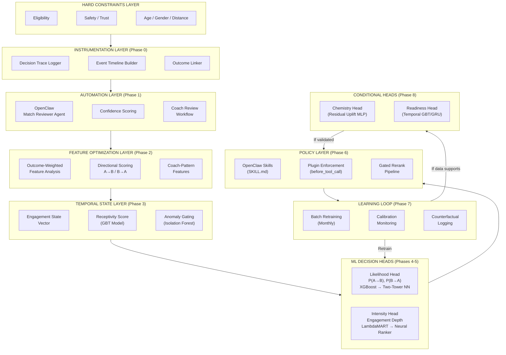
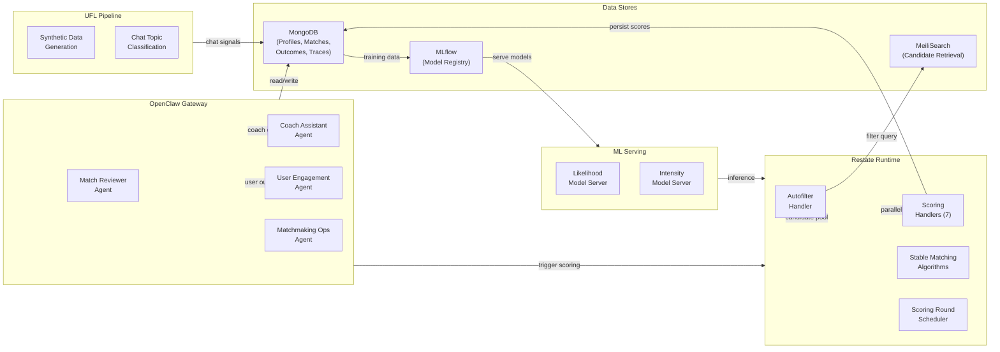
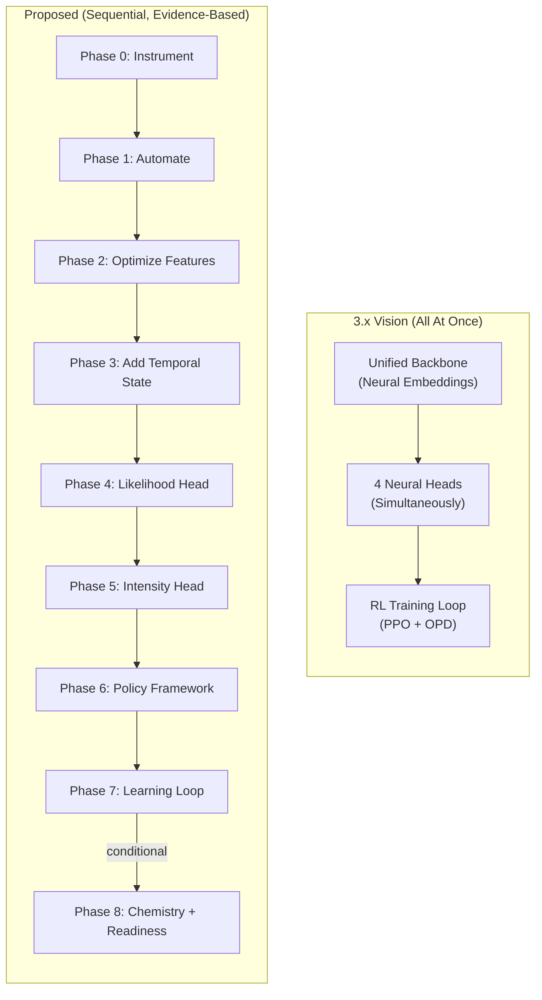
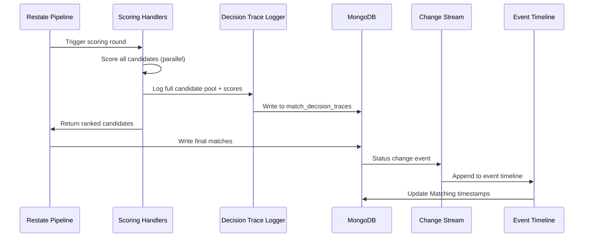
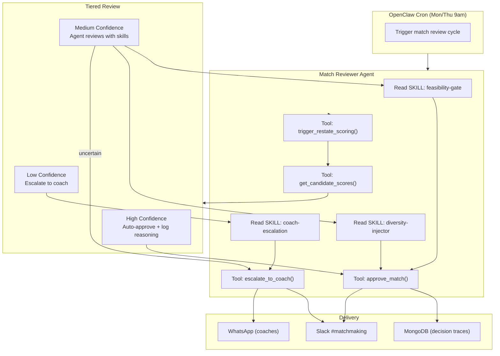
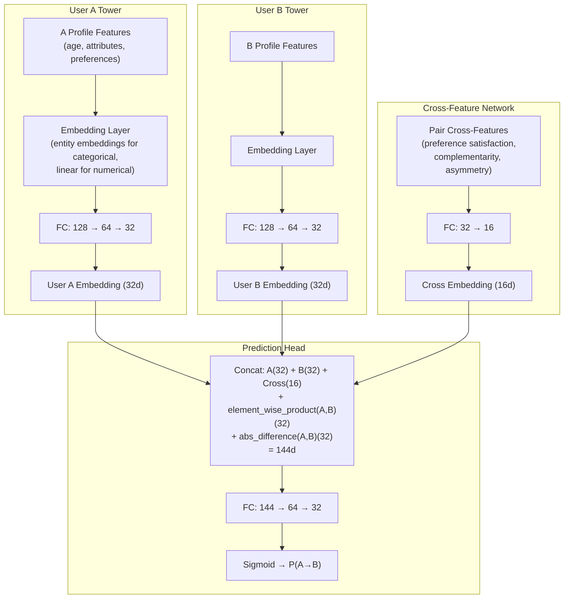
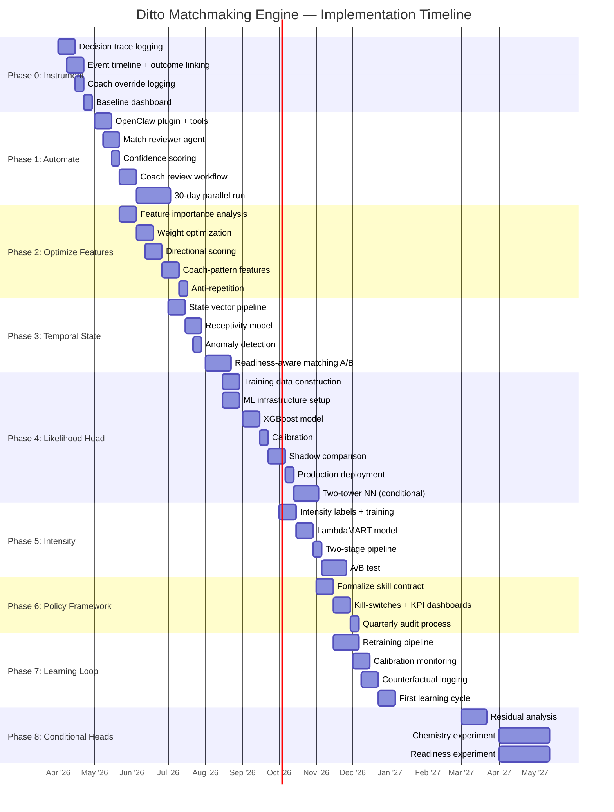
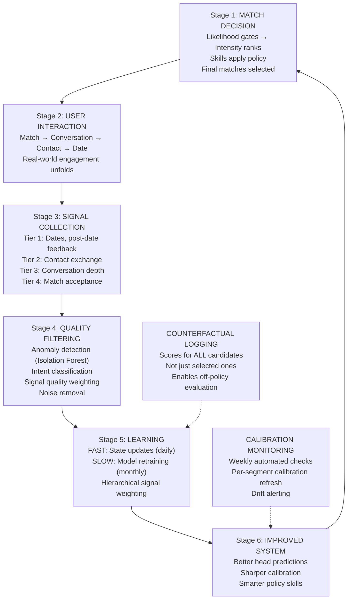

# Ditto Matchmaking Engine — Technical Implementation Plan

**Status:** Proposed Technical Strategy
**Date:** 2026-03-24
**Author:** Ryan Willis (with AI assistance)
**Context:** Evidence-based alternative to Matchmaking Engine 3.x, grounded in current codebase reality

---

## From Similarity-Based Matching to an Evidence-Driven Decision System

*Unlike the 3.x vision which proposes building all layers simultaneously, this plan sequences each investment so that every phase produces the data the next phase needs — and delivers standalone product value along the way.*

---

## Architecture Overview

### Proposed Layered Architecture



### System Integration Architecture



### Comparison with 3.x Architecture



---

## Phase 0 — Instrument Everything

**Duration:** Weeks 1-4
**Goal:** Make the current system fully observable so every subsequent decision is evidence-based.

### What It Is

A data infrastructure sprint that adds decision tracing, outcome tracking, and baseline metrics to the existing matchmaking pipeline — without changing any matching logic. This is the foundation that the 3.x doc correctly identifies as prerequisite (Phase 1 of their rollout), but scoped to minimum viable traceability.

### Tools

| Tool | Purpose | Why This Tool |
|------|---------|---------------|
| **MongoDB** (existing) | Decision trace storage, event timelines | Already the primary data store; extends existing schemas in `proj-coach-schemas` |
| **Restate side effects** (`ctx.run()`) | Log decision traces within scoring pipeline | Existing durable execution framework; traces are journaled and replay-safe |
| **MongoDB Change Streams** | Real-time event pipeline for status transitions | Native MongoDB capability; no new infrastructure needed |
| **Grafana + MongoDB Atlas Charts** | Baseline metrics dashboard | Lightweight visualization; can connect directly to MongoDB |
| **OpenClaw cron agent** (optional) | Automated weekly metrics digest to Slack | Leverages OpenClaw for scheduled reporting |

### Key Factors

1. **Schema design for decision traces** — Must capture the full candidate pool, not just winners. Each trace record stores: `cycleId`, `userId`, all `candidateIds` evaluated, per-candidate 7-feature scores, filter reasons for eliminated candidates, algorithm used, weights applied, final selection, timestamp.

2. **Event timeline normalization** — The `Matching` schema currently tracks workflow status but doesn't timestamp each stage transition. Need: `matchedAt`, `conversationStartedAt`, `contactExchangedAt`, `dateScheduledAt`, `dateFeedbackAt` as explicit timestamp fields on the `Matching` document.

3. **Coach override structure** — When coaches change a match, capture: `overrideType` (enum: `replaced`, `approved_with_notes`, `rejected`, `reordered`), `overrideReason` (enum: `wrong_vibe`, `one_sided`, `timing`, `safety`, `better_candidate_available`, `archetype_repetition`), `coachNotes` (free text), `originalPairId`, `replacementPairId`.

4. **Backward compatibility** — All new fields are additive. Existing pipeline continues to work unchanged. Traces are written as a side effect after scoring completes, not blocking the critical path.

### Algorithms

No ML algorithms in this phase. Key engineering patterns:

- **Event Sourcing** — Append-only event log for match lifecycle transitions. Each status change creates a new event document rather than mutating the existing `Matching` document. This preserves the full timeline.
- **Materialized Views** — MongoDB aggregation pipelines that compute funnel metrics (match→conversation rate, conversation→contact rate, etc.) from the event log. Refreshed daily via scheduled aggregation.

### Core Deliverables

| # | Deliverable | Acceptance Criteria |
|---|-------------|-------------------|
| 0.1 | **Decision trace collection** in `match_decision_traces` | Any match cycle from the past 7 days is fully reconstructible: candidate pool, all scores, filter reasons, final selection |
| 0.2 | **Event timeline** on `Matching` documents | Can query: "For match X, when did conversation start? When was contact exchanged? Was there a date?" |
| 0.3 | **Coach override logging** in `match_coach_overrides` | Every coach intervention has structured reason, original/replacement pair, timestamp |
| 0.4 | **Baseline metrics dashboard** | Weekly funnel: match→conversation (target: measure current rate), conversation→contact, contact→date, segmented by school |
| 0.5 | **UFL signal linking** | Chat topic classification (`date_planning`, `match_discussion`) linked to `Matching` documents via `signalLink` field |

### Technical Implementation



---

## Phase 1 — Smart Automation with Human Oversight

**Duration:** Weeks 5-10
**Goal:** Automate the mechanical parts of matchmaking while keeping coaches in the loop for quality assurance.

### What It Is

Wrap the existing Restate scoring pipeline with an OpenClaw match reviewer agent that applies confidence scoring, auto-approves high-confidence matches, and routes edge cases to coaches via WhatsApp/Slack. This is the Milestone 2 equivalent from the 3.x doc, but with a graduated human-machine handoff.

### Tools

| Tool | Purpose | Why This Tool |
|------|---------|---------------|
| **OpenClaw Gateway** | Agent runtime for match reviewer | Multi-channel delivery (Slack, WhatsApp), cron scheduling, skills system, session management |
| **OpenClaw Skills** (SKILL.md) | Composable review policies | Editable without code deployment; product team can tune |
| **OpenClaw Plugin** (`@ditto/matchmaking`) | Custom tools for DB access, Restate triggers | Bundles all matchmaking-specific tools and skills |
| **OpenClaw Cron** | Scheduled match review cycles | Built-in retry, error handling, session isolation, delivery to channels |
| **Restate** (existing) | Scoring pipeline execution | Parallel computation, durable execution — unchanged |
| **Slack / WhatsApp** (via OpenClaw channels) | Coach notification and review | Coaches already use these channels |

### Key Factors

1. **Confidence scoring** — Not a single threshold but a multi-signal assessment:
   - **Score margin**: distance between top candidate and second-best
   - **Feature agreement**: do all 7 features agree on the ranking, or are some features pulling in opposite directions?
   - **Historical base rate**: for this school/cohort, what fraction of similarly-scored matches convert?
   - **Coach override rate**: for matches in this score range, how often do coaches intervene?

2. **Tiered review workflow** — Three tiers with different handling:
   - **High confidence** (estimated >70% of matches): Auto-approve with logged reasoning
   - **Medium confidence** (estimated ~20%): Agent reviews and may approve or escalate
   - **Low confidence** (estimated ~10%): Always escalate to coach with agent analysis

3. **Trust transfer** — First 30 days: all matches go through coach confirmation regardless of confidence. Confidence tiers are computed and logged but not acted on. This builds the calibration data needed to validate the tiers.

### Algorithms

**Confidence Score Computation:**

```
confidence(pair) = w1 * margin_score + w2 * agreement_score + w3 * base_rate + w4 * (1 - coach_override_rate)

where:
  margin_score = (score_rank1 - score_rank2) / score_rank1     # Normalized margin
  agreement_score = 1 - std(feature_ranks) / mean(feature_ranks) # Cross-feature rank consistency
  base_rate = historical_conversion(school, score_bin)           # Empirical conversion rate
  coach_override_rate = historical_overrides(school, score_bin)  # How often coaches changed this tier
```

Initial weights `w1..w4` set to `[0.3, 0.2, 0.3, 0.2]`. Calibrated after 30-day observation period using logistic regression on `confidence_score → actual_outcome`.

**Confidence Tier Boundaries:**
- High: confidence > 0.7 AND margin_score > 0.15
- Low: confidence < 0.4 OR any safety flag
- Medium: everything else

### Neural Networks

None in this phase. Confidence scoring is a calibrated heuristic, not a learned model.

### Core Deliverables

| # | Deliverable | Acceptance Criteria |
|---|-------------|-------------------|
| 1.1 | **OpenClaw `@ditto/matchmaking` plugin** with tools: `get_candidate_scores`, `get_user_profile`, `get_match_history`, `approve_match`, `reject_match`, `escalate_to_coach`, `trigger_restate_scoring` | Plugin installable; all tools functional against MongoDB and Restate |
| 1.2 | **Match reviewer agent** with standing orders and skills | Agent runs match review cycle on cron; applies feasibility-gate, diversity-injector, coach-escalation skills |
| 1.3 | **Confidence scoring service** | Every proposed match has a confidence tier (High/Medium/Low) with score breakdown |
| 1.4 | **Coach review workflow** via Slack/WhatsApp | Coaches receive match proposals with agent reasoning; can approve/override with structured feedback |
| 1.5 | **30-day parallel run** | Both automated and coach-reviewed matches tracked; comparison report shows automated >= coach quality |

### OpenClaw Agent Architecture



---

## Phase 2 — Feature-Driven Quality Improvement

**Duration:** Weeks 8-16 (overlaps Phase 1)
**Goal:** Use outcome data from Phase 0 and coach feedback from Phase 1 to improve match quality within the existing architecture.

### What It Is

An analytical sprint that answers: "Which of our 7 features actually predict real outcomes?" Then optimizes feature weights, adds directional scoring (A→B vs B→A), and introduces coach-derived features — all without any new ML infrastructure.

### Tools

| Tool | Purpose | Why This Tool |
|------|---------|---------------|
| **Python / scikit-learn** | Feature importance analysis, logistic regression | Standard ML toolkit; team has Python expertise (UFL is Python) |
| **SHAP** (SHapley Additive exPlanations) | Feature importance with interaction effects | Goes beyond correlation — shows causal contribution of each feature |
| **XGBoost** | Initial weight optimization model | Handles non-linear feature interactions; interpretable via feature importance |
| **Jupyter Notebooks** | Exploratory analysis, reporting | Interactive analysis; shareable with team |
| **MongoDB Aggregation** | Training data construction from decision traces + outcomes | Direct query on existing data; no ETL pipeline needed |

### Key Factors

1. **Outcome-weighted analysis** — Not all outcomes are equal:
   - Tier 1 (date occurred): weight 4x
   - Tier 2 (contact exchanged): weight 3x
   - Tier 3 (deep conversation, >10 messages): weight 2x
   - Tier 4 (conversation started): weight 1x
   - Tier 0 (no response / one-sided): weight 0

2. **Feature interaction effects** — Some features matter more in combination. E.g., high vibe + high lifestyle > sum of parts. SHAP interaction values reveal these.

3. **Directional asymmetry** — The existing PIM scoring already computes forward/reverse scores. Extend this pattern: for each feature, compute how A's attributes satisfy B's preferences AND how B's attributes satisfy A's preferences. Mutual feasibility = f(A→B, B→A), not just similarity.

### Algorithms

**Outcome-Weighted Feature Importance:**

```python
# Construct training data from Phase 0 decision traces + outcome timelines
X = feature_scores[['pim', 'hobby', 'attractiveness', 'vibe', 'height', 'lifestyle', 'pim_reverse']]
y = outcome_tier  # 0-4 scale

# Hierarchical weighting
sample_weights = y.map({0: 0.1, 1: 1.0, 2: 2.0, 3: 3.0, 4: 4.0})

# XGBoost with weighted outcomes
model = XGBClassifier(objective='multi:softmax', num_class=5)
model.fit(X, y, sample_weight=sample_weights)

# SHAP analysis
explainer = shap.TreeExplainer(model)
shap_values = explainer.shap_values(X)
# → Reveals: which features predict Tier 1-2 outcomes vs only Tier 3-4
```

**Directional Scoring Refactor:**

```
mutual_feasibility(A, B) = geometric_mean(
    pim_forward(A, B),    # How well B matches A's preferences
    pim_reverse(A, B)     # How well A matches B's preferences
) * agreement_bonus(A, B) # Bonus when both directions are strong

where:
    agreement_bonus = 1 + alpha * min(pim_forward, pim_reverse) / max(pim_forward, pim_reverse)
    alpha = 0.2  # Tuned on outcome data
```

**Anti-Repetition via Archetype Clustering:**

```python
# Cluster user profiles into archetypes using k-means on normalized feature vectors
from sklearn.cluster import KMeans

profile_features = normalize(profiles[['age', 'interests_embedding', 'lifestyle_vector', ...]])
kmeans = KMeans(n_clusters=15, random_state=42)  # 15 archetypes per school
archetypes = kmeans.fit_predict(profile_features)

# For each user, track recent match archetypes
recent_archetypes = get_recent_match_archetypes(user_id, window=5)  # Last 5 matches
archetype_saturation = len(set(recent_archetypes)) / len(recent_archetypes)  # 0-1, higher = more diverse

# Penalize repeat-archetype matches in scoring
diversity_penalty = (1 - archetype_saturation) * penalty_weight  # penalty_weight tuned on outcomes
adjusted_score = raw_score - diversity_penalty  # When same archetype repeated
```

### Neural Networks

None in this phase. Tabular ML (XGBoost, logistic regression) is appropriate for the data volume and feature type.

### Core Deliverables

| # | Deliverable | Acceptance Criteria |
|---|-------------|-------------------|
| 2.1 | **Feature importance report** | For each of 7 features: SHAP importance for Tier 1-2 vs Tier 3-4 outcomes. Published and reviewed by team. |
| 2.2 | **Optimized feature weights** | New weights outperform hand-tuned weights on held-out data (measured by Tier 1-2 outcome prediction AUC) |
| 2.3 | **Directional scoring** | Mutual feasibility gate using A→B and B→A. Wasted-match rate (one side never responds) reduced by >= 20% |
| 2.4 | **Coach-pattern features** | >= 1 new feature derived from structured coach override data. Validated against outcomes. |
| 2.5 | **Archetype diversity** | Anti-repetition scoring live. Users see measurably more diverse match archetypes without quality loss. |

---

## Phase 3 — Lightweight Temporal Awareness

**Duration:** Weeks 14-22 (overlaps Phase 2)
**Goal:** Introduce user state into matching decisions without building a full neural temporal encoder.

### What It Is

A daily-computed per-user state vector that captures engagement, receptivity, outcome trajectory, and archetype saturation. Used to adjust matching decisions — conservative matches for fatigued users, wider exploration for users in good trajectory.

### Tools

| Tool | Purpose | Why This Tool |
|------|---------|---------------|
| **LightGBM** | Receptivity prediction model | Fast training, handles sparse features, excellent for tabular data |
| **scikit-learn (Isolation Forest)** | Anomaly detection for aberrant sessions | Unsupervised; no labeled anomaly data needed |
| **K-Means** (from Phase 2) | Archetype clustering for saturation measurement | Already built; reuse clusters |
| **MongoDB TTL Collections** | State vector storage with automatic expiry | Daily state snapshots; old snapshots auto-expire after 90 days |
| **Python batch job** (cron) | Daily state computation | Simple; runs after midnight; writes to `user_engagement_states` collection |

### Key Factors

1. **State vector schema** — Per-user, computed daily:
   ```
   {
     userId, computedAt,
     activityLevel: sessions_per_week (float),
     responsiveness: reply_rate * (1 / avg_reply_latency_hours) (float),
     outcomeTrajectory: exponential_moving_avg of outcome_tiers over last 5 matches (float),
     archetypeSaturation: diversity_ratio from Phase 2 (float),
     matchFrequency: matches_per_week (float),
     engagementTrend: slope of activityLevel over last 4 weeks (float),
     anomalyScore: isolation_forest_score (float),
     receptivityScore: model_prediction (float, computed in step 2)
   }
   ```

2. **Recency weighting** — Recent interactions carry disproportionate weight:
   ```
   effective_weight(event) = exp(-lambda * days_since_event)
   lambda = 0.1  # Half-life of ~7 days
   ```

3. **Anomaly gating** — Sessions with extreme behavior (all-accept, all-reject, abnormally fast interactions) are detected and down-weighted before state computation. This prevents a single bad session from corrupting the user's state.

### Algorithms

**Receptivity Prediction (LightGBM):**

```python
# Training data: for each user-week, did they respond positively to any match?
features = [
    'activity_level', 'responsiveness', 'outcome_trajectory',
    'archetype_saturation', 'match_frequency', 'engagement_trend',
    'days_since_last_positive_outcome', 'coach_notes_sentiment',
    'preference_edit_recency'  # Did they recently edit preferences?
]
target = 'responded_positively_this_week'  # Binary

model = LGBMClassifier(
    n_estimators=200, max_depth=6, learning_rate=0.05,
    min_child_samples=20,  # Conservative to avoid overfitting on small data
    class_weight='balanced'  # Handle class imbalance
)
model.fit(X_train, y_train)
```

**Anomaly Detection (Isolation Forest):**

```python
# Per-session features
session_features = [
    'acceptance_rate',       # Fraction of candidates accepted
    'interaction_velocity',  # Actions per minute
    'session_duration',      # Total time
    'decision_consistency'   # Entropy of accept/reject pattern
]

iso_forest = IsolationForest(
    n_estimators=100,
    contamination=0.05,  # Expect ~5% anomalous sessions
    random_state=42
)
anomaly_labels = iso_forest.fit_predict(session_df[session_features])
# -1 = anomalous, 1 = normal
```

**Readiness-Aware Matching Adjustment:**

```
adjusted_threshold(user) =
    base_threshold                                    # 0.6 default
    + (1 - receptivity_score) * threshold_increase    # Raise threshold for low-receptivity users
    - engagement_trend * threshold_decrease            # Lower threshold for users on upward trend

where:
    threshold_increase = 0.15  # Max increase for lowest receptivity
    threshold_decrease = 0.10  # Max decrease for strongest upward trend

    Clamped to [0.4, 0.8] range
```

### Neural Networks

None in this phase. Gradient boosted trees (LightGBM) are appropriate for the feature type (tabular), data volume (hundreds to low thousands of user-weeks), and interpretability requirements (SHAP explanations for debugging).

### Core Deliverables

| # | Deliverable | Acceptance Criteria |
|---|-------------|-------------------|
| 3.1 | **Daily state computation pipeline** | State vector computed for all active users by 6am; stored in `user_engagement_states` |
| 3.2 | **Receptivity model** | AUC > 0.65 on held-out data; distinguishes high-engagement from low-engagement periods |
| 3.3 | **Anomaly gating** | Inject synthetic anomalous sessions; verify they are down-weighted (anomaly score < -0.5) |
| 3.4 | **Readiness-aware matching** | A/B test: readiness-adjusted thresholds vs fixed thresholds. Conversion rate improves for both cohorts. |
| 3.5 | **Fatigue detection** | Users with declining engagement (negative `engagementTrend` for 3+ weeks) get wider archetype diversity |

---

## Phase 4 — Likelihood Head

**Duration:** Weeks 20-30
**Goal:** Build the first proper ML decision head — predicting directional feasibility P(A→B) and P(B→A).

### What It Is

A trained model that replaces the heuristic feasibility gate from Phase 2 with a learned prediction: "Will User A respond positively to User B?" and vice versa. This is the single highest-value ML component in the entire strategy.

### Tools

| Tool | Purpose | Why This Tool |
|------|---------|---------------|
| **XGBoost** | Initial tabular model (Phase 4a) | Strong baseline; handles mixed feature types; fast training |
| **PyTorch** | Two-tower neural model (Phase 4b, if XGBoost plateaus) | Flexible architecture; pair-level cross-features |
| **MLflow** | Experiment tracking, model versioning, model registry | Standard MLOps; tracks hyperparameters, metrics, artifacts |
| **FastAPI** (Python microservice) | Model serving | Lightweight; integrates with Restate via HTTP calls |
| **Platt Scaling / Isotonic Regression** | Calibration | Post-hoc calibration of model outputs to true probabilities |
| **Optuna** | Hyperparameter optimization | Bayesian optimization; efficient search over hyperparameter space |

### Key Factors

1. **Training data construction** — From Phase 0 outcome data:
   - **Positive (mutual match)**: Both users matched + conversation started within 48h. Label = 1.0
   - **Soft positive (one-sided positive)**: A matched with B but B did not reciprocate. Label for A→B = 1.0, B→A = 0.0.
   - **Negative**: Shown but no match. Label = 0.0.
   - **Attribution window**: 7 days from exposure to outcome.
   - **Minimum training set**: >= 10,000 labeled pairs (accumulates over ~5 months from Phase 0)

2. **Feature engineering for pairs** — Three feature families:
   - **User-level** (per user): normalized profile attributes, engagement state from Phase 3, preference vector
   - **Pair-level cross-features**: preference satisfaction (does B match A's stated preferences?), trait complementarity (absolute difference in key attributes), directional asymmetry (|A→B score - B→A score|)
   - **Historical**: past match outcomes for similar pairs in same school/cohort

3. **Directional modeling** — The model must predict A→B and B→A separately, not just a symmetric score:
   ```
   P(A→B) = model(features_A, features_B, cross_features_AB, preference_satisfaction_A_for_B)
   P(B→A) = model(features_B, features_A, cross_features_BA, preference_satisfaction_B_for_A)
   mutual_feasibility = sqrt(P(A→B) * P(B→A))  # Geometric mean
   ```

4. **Calibration** — A score of 0.7 must mean ~70% of such pairs actually convert. Calibrate per-segment (school, gender, activity level) using isotonic regression on held-out validation set.

### Algorithms

**Phase 4a — XGBoost Baseline:**

```python
# Feature matrix: each row is a directed pair (A→B)
features = [
    # User A features
    'a_age', 'a_activity_level', 'a_receptivity_score', 'a_outcome_trajectory',
    # User B features
    'b_age', 'b_activity_level', 'b_receptivity_score', 'b_outcome_trajectory',
    # Pair cross-features
    'preference_satisfaction_a_for_b',  # How well B matches A's preferences
    'trait_complementarity',             # Structured difference vector
    'age_difference',
    'lifestyle_compatibility',
    'vibe_score', 'pim_forward_score', 'hobby_score',
    'attractiveness_difference',
    'height_compatibility',
    # Historical
    'school_base_rate', 'archetype_pair_base_rate'
]
target = 'positive_response'  # Binary: did this user respond positively?

model = XGBClassifier(
    n_estimators=500, max_depth=6, learning_rate=0.03,
    min_child_weight=10, subsample=0.8, colsample_bytree=0.8,
    scale_pos_weight=neg_count/pos_count,  # Handle class imbalance
    eval_metric='auc', early_stopping_rounds=50
)

# Calibration
from sklearn.calibration import CalibratedClassifierCV
calibrated_model = CalibratedClassifierCV(model, method='isotonic', cv=5)
calibrated_model.fit(X_train, y_train)
```

**Phase 4b — Two-Tower Neural Model (if XGBoost plateaus):**



```python
class LikelihoodTwoTower(nn.Module):
    def __init__(self, user_feat_dim, cross_feat_dim, embed_dim=32):
        super().__init__()
        # Shared user tower (weight-shared for A and B)
        self.user_tower = nn.Sequential(
            nn.Linear(user_feat_dim, 128),
            nn.ReLU(), nn.BatchNorm1d(128), nn.Dropout(0.3),
            nn.Linear(128, 64),
            nn.ReLU(), nn.BatchNorm1d(64), nn.Dropout(0.2),
            nn.Linear(64, embed_dim)
        )
        # Cross-feature network
        self.cross_net = nn.Sequential(
            nn.Linear(cross_feat_dim, 32),
            nn.ReLU(), nn.Dropout(0.2),
            nn.Linear(32, 16)
        )
        # Prediction head
        head_dim = embed_dim * 4 + 16  # concat + product + diff + cross
        self.head = nn.Sequential(
            nn.Linear(head_dim, 64),
            nn.ReLU(), nn.BatchNorm1d(64), nn.Dropout(0.3),
            nn.Linear(64, 32),
            nn.ReLU(),
            nn.Linear(32, 1),
            nn.Sigmoid()
        )

    def forward(self, user_a_features, user_b_features, cross_features):
        a_emb = self.user_tower(user_a_features)
        b_emb = self.user_tower(user_b_features)
        cross_emb = self.cross_net(cross_features)

        combined = torch.cat([
            a_emb, b_emb,
            a_emb * b_emb,           # Element-wise product (interaction)
            torch.abs(a_emb - b_emb), # Absolute difference (asymmetry)
            cross_emb
        ], dim=1)

        return self.head(combined)  # P(A→B)

# Training: Binary cross-entropy with hierarchical sample weighting
# Tier 1 outcomes weighted 4x, Tier 2 3x, etc.
loss_fn = nn.BCELoss(reduction='none')
weighted_loss = (loss_fn(pred, target) * sample_weights).mean()
```

### Core Deliverables

| # | Deliverable | Acceptance Criteria |
|---|-------------|-------------------|
| 4.1 | **Training dataset** | >= 10K labeled directed pairs with outcome attribution |
| 4.2 | **ML infrastructure** | MLflow tracking, model versioning, FastAPI serving, offline evaluation pipeline |
| 4.3 | **Likelihood model (XGBoost)** | AUC > directional scoring heuristic from Phase 2 on held-out data |
| 4.4 | **Calibration** | Calibration error < 0.05 across major segments (school, gender, activity) |
| 4.5 | **Shadow comparison** | 2-week shadow run: Likelihood model vs heuristic. Confirm improvement before production. |
| 4.6 | **Production deployment** | Likelihood-gated matching live. Wasted-match rate reduced further vs Phase 2. |
| 4.7 | **Two-tower model** (conditional) | If XGBoost AUC plateaus, deploy neural model. Must beat XGBoost by >= 0.02 AUC. |

---

## Phase 5 — Intensity Ranking

**Duration:** Weeks 28-36 (overlaps Phase 4)
**Goal:** Among feasible pairs, rank by expected interaction strength — not just "can this work?" but "how strong will it be?"

### What It Is

A learning-to-rank model that reorders feasible candidates by predicted engagement depth: conversation quality, contact exchange probability, date probability. This is the second ML head, operating downstream of the Likelihood gate.

### Tools

| Tool | Purpose | Why This Tool |
|------|---------|---------------|
| **LightGBM with LambdaRank** | Learning-to-rank objective | Native ranking support in LightGBM; handles position bias |
| **PyTorch** (optional) | Neural ranker if tabular plateaus | Attention-based ranking model |
| **Same ML infra from Phase 4** | Experiment tracking, model serving | Reuse MLflow, FastAPI serving |
| **NDCG@K** | Primary evaluation metric | Standard ranking metric; measures quality of top-K ordering |

### Key Factors

1. **Intensity labels** — Hierarchical outcome tiers as relevance labels for learning-to-rank:
   - Relevance 4: Date occurred
   - Relevance 3: Contact exchanged
   - Relevance 2: Deep conversation (>10 messages, >3 days)
   - Relevance 1: Conversation started
   - Relevance 0: No engagement

2. **Conditioned on feasibility** — Intensity only trains and predicts on pairs that pass the Likelihood gate (mutual_feasibility > threshold). This prevents the model from wasting capacity on infeasible pairs.

3. **User-state conditioning** — Intensity predictions should incorporate the user's current state (Phase 3). A user with strong recent outcomes may respond differently than one in a fatigue period.

### Algorithms

**LambdaMART (Primary):**

```python
import lightgbm as lgb

# Training data: groups of candidates per user, ordered by outcome tier
# Each group = one user's candidate pool from one cycle
train_data = lgb.Dataset(
    X_train, label=y_train,
    group=group_sizes,  # Number of candidates per user
    free_raw_data=False
)

params = {
    'objective': 'lambdarank',
    'metric': 'ndcg',
    'ndcg_eval_at': [3, 5, 10],
    'learning_rate': 0.05,
    'num_leaves': 63,
    'min_data_in_leaf': 10,
    'max_depth': 7,
    'feature_fraction': 0.8,
    'bagging_fraction': 0.8,
    'bagging_freq': 5,
    'lambdarank_truncation_level': 10  # Focus on top-10 ordering
}

model = lgb.train(params, train_data, num_boost_round=500,
                  valid_sets=[valid_data], callbacks=[lgb.early_stopping(50)])
```

**Neural Ranker (If LambdaMART Plateaus):**

```python
class IntensityRanker(nn.Module):
    """Pair-level ranking model with attention over feature dimensions."""
    def __init__(self, feat_dim, n_heads=4):
        super().__init__()
        self.pair_encoder = nn.Sequential(
            nn.Linear(feat_dim, 128), nn.ReLU(), nn.Dropout(0.3),
            nn.Linear(128, 64), nn.ReLU()
        )
        # Self-attention over feature groups (profile, interaction, temporal)
        self.attention = nn.MultiheadAttention(embed_dim=64, num_heads=n_heads, batch_first=True)
        self.ranker_head = nn.Sequential(
            nn.Linear(64, 32), nn.ReLU(), nn.Linear(32, 1)
        )

    def forward(self, pair_features):
        # pair_features: (batch, n_feature_groups, feat_dim)
        encoded = self.pair_encoder(pair_features)
        attended, _ = self.attention(encoded, encoded, encoded)
        pooled = attended.mean(dim=1)  # Average pool across feature groups
        return self.ranker_head(pooled)

# Training: ListNet loss (softmax cross-entropy over rankings)
def listnet_loss(pred_scores, true_relevance):
    pred_probs = F.softmax(pred_scores, dim=0)
    true_probs = F.softmax(true_relevance.float(), dim=0)
    return -torch.sum(true_probs * torch.log(pred_probs + 1e-10))
```

### Core Deliverables

| # | Deliverable | Acceptance Criteria |
|---|-------------|-------------------|
| 5.1 | **Intensity training set** | Labeled pairs with outcome tier, grouped by user-cycle |
| 5.2 | **LambdaMART model** | NDCG@5 > weighted-score baseline among feasible pairs |
| 5.3 | **Two-stage pipeline** | Likelihood gates → Intensity ranks → stable matching on Intensity-ranked pairs |
| 5.4 | **A/B test** | Two-stage vs single-stage. Significant lift on conversation depth + contact exchange rate. |

---

## Phase 6 — Plugin Framework and Controlled Exploration

**Duration:** Weeks 34-42
**Goal:** Formalize the policy layer with a composable skill/plugin framework on OpenClaw.

### What It Is

The policy skills that emerged organically in Phases 1-5 are now formalized into a structured plugin framework with explicit contracts, KPI tracking, kill-switches, and governance.

### Tools

| Tool | Purpose |
|------|---------|
| **OpenClaw Skills** (SKILL.md) | Policy definitions (editable by product team) |
| **OpenClaw Plugin hooks** (`before_tool_call`, `after_tool_call`) | Hard enforcement at runtime |
| **OpenClaw Cron** | Scheduled policy audits |
| **Grafana** | Per-skill KPI dashboards |

### Core Skills (Maximum 5 Active)

| Skill | What It Does | KPI |
|-------|-------------|-----|
| **feasibility-gate** | Filter candidates below calibrated Likelihood threshold | Wasted-match rate |
| **diversity-injector** | Detect archetype saturation; inject bounded diversity | Archetype diversity index |
| **exploration-budget** | Allocate 5-10% of exposures to non-top-ranked feasible candidates | Discovery rate (exploration matches that outperform) |
| **coach-insight** | Surface Likelihood + Intensity scores to coaches with explanations | Coach review time, override rate on high-confidence |
| **trust-safety** | Non-overridable safety filter via plugin hook enforcement | Safety incident rate (must be 0) |

### Core Deliverables

| # | Deliverable | Acceptance Criteria |
|---|-------------|-------------------|
| 6.1 | **Formal skill contract** | All 5 skills implement consistent interface; per-skill KPI tracked |
| 6.2 | **Plugin runtime with kill-switches** | Any skill disableable in < 1 minute; auto-revert if KPI degrades |
| 6.3 | **Quarterly audit process** | Documented process: disable each skill individually, measure impact, remove if no positive effect |

---

## Phase 7 — Learning Loop v1

**Duration:** Weeks 40-52
**Goal:** Close the loop — use accumulated outcome data to retrain models and calibrate continuously.

### What It Is

A supervised retraining pipeline (not RL) that monthly refreshes Likelihood and Intensity models on the latest outcome data, with hierarchical signal weighting and automated calibration monitoring.

### Tools

| Tool | Purpose |
|------|---------|
| **Apache Airflow** (or simple cron + Python) | Monthly retraining orchestration |
| **MLflow Model Registry** | Model versioning, staging → production promotion |
| **Isotonic Regression** | Continuous calibration refresh |
| **Inverse Propensity Scoring (IPS)** | Counterfactual evaluation on logged data |
| **Great Expectations** | Data quality validation before retraining |

### Algorithms

**Hierarchical Signal Weighting for Retraining:**

```python
# Each training sample weighted by outcome tier
tier_weights = {
    'date_occurred': 4.0,
    'contact_exchanged': 3.0,
    'deep_conversation': 2.0,
    'conversation_started': 1.0,
    'no_engagement': 0.5  # Not zero — negative signal has value
}

# Time decay: recent outcomes weighted more
time_weight = exp(-0.02 * days_since_outcome)  # Half-life ~35 days

# Combined
sample_weight = tier_weights[outcome] * time_weight
```

**Counterfactual Evaluation (IPS):**

```python
# For each match decision, we logged all candidate scores (Phase 0)
# IPS estimates performance of alternative policy from logged data

def ips_estimate(logged_data, new_policy):
    """Estimate new policy's expected outcome from historical logs."""
    estimates = []
    for decision in logged_data:
        # Would the new policy have selected the same candidate?
        new_selection = new_policy.select(decision.candidate_pool, decision.scores)
        if new_selection == decision.actual_selection:
            # Importance weight = 1 / P(selection under logging policy)
            importance_weight = 1.0 / decision.selection_probability
            estimates.append(importance_weight * decision.outcome_value)
    return np.mean(estimates)
```

### Core Deliverables

| # | Deliverable | Acceptance Criteria |
|---|-------------|-------------------|
| 7.1 | **Monthly retraining pipeline** | Automated: fetch latest 6 months of data → train → evaluate on held-out → stage in MLflow |
| 7.2 | **Calibration monitoring** | Weekly automated check. Alert if calibration error > 0.08 in any segment. |
| 7.3 | **Counterfactual logging** | Full candidate pools with scores logged for ALL candidates (not just winners) |
| 7.4 | **First learning cycle** | Retrained model deployed; measurable improvement over original. Evidence flywheel is turning. |

---

## Phase 8 — Chemistry & Readiness (Conditional)

**Duration:** Months 12-18 (only if data justifies)
**Goal:** Investigate whether Chemistry and Readiness heads add value beyond Likelihood + Intensity + plugins.

### Go/No-Go Criteria

| Criterion | Required for Go |
|-----------|----------------|
| **Residual variance** | >= 15% of outcome variance unexplained by Likelihood + Intensity |
| **Data volume** | >= 50K matched pairs with Tier 1-2 outcomes |
| **Timing effect** | Statistically significant difference in conversion rate between high-receptivity and low-receptivity periods (from Phase 3 data) |

### Chemistry Head — Residual Uplift Model

**Architecture:** MLP trained on pair cross-features, predicting outcome residual after accounting for Likelihood + Intensity predictions.

```python
class ChemistryHead(nn.Module):
    """Predicts residual uplift beyond Likelihood + Intensity baseline."""
    def __init__(self, cross_feat_dim):
        super().__init__()
        self.net = nn.Sequential(
            nn.Linear(cross_feat_dim + 2, 64),  # +2 for L and I predictions
            nn.ReLU(), nn.BatchNorm1d(64), nn.Dropout(0.3),
            nn.Linear(64, 32), nn.ReLU(),
            nn.Linear(32, 1), nn.Tanh()  # Output in [-1, 1] range
        )

    def forward(self, cross_features, likelihood_pred, intensity_pred):
        x = torch.cat([cross_features, likelihood_pred, intensity_pred], dim=1)
        return self.net(x)  # Predicted residual uplift

# Training target: actual_outcome - predicted_baseline
# Where predicted_baseline = f(likelihood_score, intensity_score)
residual = actual_outcome_normalized - baseline_prediction
# Only train on pairs where |residual| > noise_threshold
```

### Readiness Head — Temporal Gating Model

**Architecture:** GBT or GRU on temporal features only (no static profile features to prevent collapse into Likelihood).

```python
# STRICT feature constraint: temporal and state features ONLY
readiness_features = [
    'receptivity_score',        # From Phase 3
    'days_since_last_match',
    'recent_outcome_trajectory',
    'archetype_saturation',
    'engagement_trend',
    'session_recency_hours',
    'day_of_week',
    'time_since_preference_edit'
]
# EXCLUDED: age, attractiveness, profile attributes, preference vectors
# (these would cause Readiness to collapse into Likelihood)

# Readiness target: timing-conditional conversion
# Did this pair convert BETTER than expected given their Likelihood + Intensity scores?
timing_lift = actual_conversion - expected_conversion_at_this_quality_level
```

### Core Deliverables

| # | Deliverable | Acceptance Criteria |
|---|-------------|-------------------|
| 8.1 | **Residual analysis report** | Quantified unexplained variance. Go/no-go decision documented. |
| 8.2 | **Chemistry model** (conditional) | Chemistry-promoted pairs show positive Tier 1-2 outcome lift in ablation |
| 8.3 | **Readiness model** (conditional) | Readiness-gated timing improves conversion conditional on pair quality |
| 8.4 | **Ablation tests** | Each head must demonstrate real outcome lift. If not, do not ship. |

---

## Timeline



### Key Dates

| Milestone | When | What Ships |
|-----------|------|-----------|
| **Instrumented** | May 2026 | Full decision traceability; baseline metrics live |
| **Automated** | July 2026 | Machine-driven matching with coach oversight via OpenClaw |
| **Optimized** | August 2026 | Feature weights optimized; directional scoring; anti-repetition |
| **Stateful** | September 2026 | Temporal user state; readiness-aware matching |
| **ML-Driven** | November 2026 | Likelihood + Intensity heads; two-stage pipeline |
| **Policy-Governed** | December 2026 | Formal plugin framework; 5 composable skills |
| **Self-Improving** | January 2027 | Learning loop operational; first retrain cycle |
| **Full System** (conditional) | Mid 2027 | Chemistry + Readiness heads if data supports |

---

## Learning & Feedback Flywheel



---

## Risk Matrix

| Risk | Impact | Likelihood | Mitigation |
|------|--------|-----------|-----------|
| **Insufficient training data for ML heads** | High | Medium | Phases 0-3 accumulate 5+ months of data before Phase 4 starts. Synthetic data from UFL supplements. |
| **Coach resistance to automation** | High | Medium | 30-day parallel run (Phase 1). Graduated trust transfer. Coach insights skill keeps them empowered. |
| **Temporal state adds noise** | Medium | Medium | LightGBM with anomaly gating. Simple features first. A/B test before production. |
| **Chemistry/Readiness don't add value** | Medium | High | Explicitly conditional. Go/no-go criteria. If no value, don't ship. |
| **OpenClaw operational complexity** | Medium | Low | Single gateway, 4 agents. Security hardened per guide. Kill-switches on all skills. |
| **Calibration drift** | Medium | Medium | Weekly automated monitoring. Per-segment refresh. Alert on error > 0.08. |

---

## References

- Ditto Matchmaking Engine 3.x Strategy: `docs/Ditto Matchmaking Engine 3 x 326d2ecb07cc804a90e1da42480d0aad.md`
- OpenClaw Technical Guide: `docs/OpenClaw Deep Technical Guide - Matchmaking Integration.md`
- UFL Project: `projects/ufl/`
- Profile Analysis Service: `projects/profile-analysis-service/`
- Stable Matching Service: `projects/proj-coach-backend/src/internal/stable-matching/`
